# MySQL介绍及安装

# 一、MySQL概述

## 1、关系型数据库与非关系型数据库

RDBMS（relational database management system），既关系型数据库管理系统。

简单来说，关系型数据库，是指采用了==二维表格==来组织数据的数据库。


> 扩展：数据库在行业内一般会有两种情况，关系型数据库与非关系型数据库。非关系型数据库并不是通过二维表格来维护数据的，而是通过key/value键值对来维护数据的。

## 2、常见的关系型数据库

==oracle、mysql==、DB2（IBM）、Sybase、==SQL server==（Microsoft微软）、IBM Informix

关系型数据库的**最大特点就是==事务的一致性==**：所以也在对事物一致性的维护中有很大的开销.

## 3、什么是事务

1）事务由一条或者多条sql语句组成；

2）在事务中的操作，这些sql语句要么都成功执行，要么都不执行，这就是一个事务。 

==举例说明：==

1.     登陆ATM机，输入密码； 
2.     连接数据库，验证密码； 
3.     验证成功，获得用户信息，比如存款余额等； 
4.     用户输入需要转账的金额，按下确认键；
5.     ==从后台数据库中减掉用户账户上的对应金额（update语句）；== 
6.     ==从后台数据库中给对方账户增加相应的金额（update语句）；== 
7.     确认，退卡，走人；

## 4、事务特点(ACID）

- 原子性(Atomicity)：

  事务中的全部操作在数据库中是不可分割的，要么==全部完成==，要么==均不执行==。

- 一致性(Consistency)：

  指事务必须使数据库从一个一致性状态变换到另一个一致性状态，也就是说一个事务执行之前和执行之后都必须处于一致性状态，不能破坏关系数据的完整性以及业务逻辑上的一致性。

- 隔离性(Isolation)：

  一个事务的执行不受其他事务的干扰，事务执行的中间结果对其他事务必须是透明的。隔离性是当多个用户并发访问数据库时，比如操作同一张表时，数据库为每一个用户开启的事务，不能被其他事务的操作所干扰，多个并发事务之间要相互隔离。 

- 持久性(Durability)：

  持久性是指一个事务一旦被提交了，那么对数据库中的数据的改变就是永久性的，即便是在数据库系统遇到故障的情况下也不会丢失提交事务的操作。 

> 对数据的==一致性==要求较高;典型的==银行及支付系统类==；

## 5、MySQL数据库概述

- MySQL是一种关系型数据库管理系统
- 由瑞典MySQL AB 公司开发，目前属于Oracle旗下
- MySQL是C/S架构

## 6、MySQL数据库版本

- **社区版：MySQL Community Edition  (==GPL==) **
  1. 可以看做是企业版的“广泛体验版（小白鼠版）”，未经各个专有系统平台的压力测试和性能测试
  2. 基于GPL协议发布，可以随意下载使用 
  3. 没有任何官方技术支持服务 

- **企业版：MySQL Enterprise Edition(==commercial==) **
  1. 提供了比较全面的高级功能、管理工具及技术支持 
  2. 安全性、稳定性、可扩展性比较好

- **集群版**：MySQL Cluster CGE(==commercial==) 

**扩充：关于版本的命名方式如何定义？**

| 版本                       | 说明                                                         |
| -------------------------- | ------------------------------------------------------------ |
| α（Alpha）版               | 内测版，内部交流或者专业测试人员测试用。Bug较多，普通用户最好不要安装。 |
| β（Beta）版                | 公测版，专业爱好者大规模测试用，存在一些缺陷，该版本也不适合一般用户安装。 |
| γ ( Gamma )版              | 相当成熟的测试版，与即将发行的正式版相差无几。               |
| ==Final==                  | 正式版本                                                     |
| Free                       | 自由版本                                                     |
| ==Release==                | 发行版本                                                     |
| ==Standard==               | 标准版本                                                     |
| ==Mini==                   | 迷你精简版本,只有最基本的功能                                |
| Upgrade                    | 升级版本                                                     |
| ==GA(GenerallyAvailable)== | 开发团队认为该版本是稳定版,可以在较为关键的场合使用。        |
| Retail                     | 零售版                                                       |

## 7、获取MySQL软件

官网：www.mysql.com

第一步：单击Downloads下载

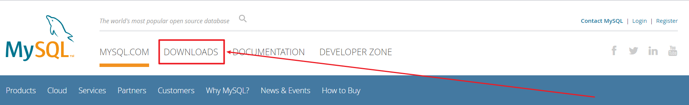

第二步：找到社区版

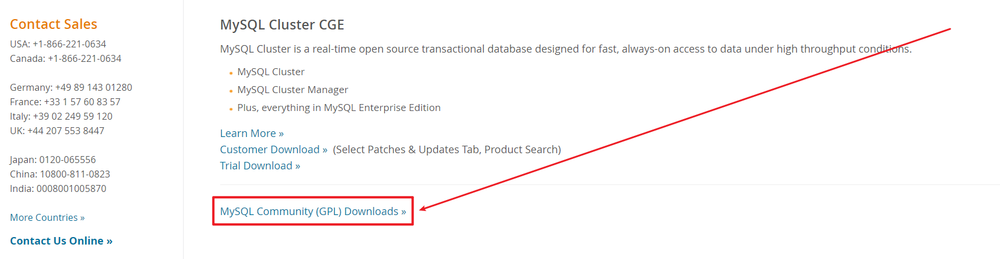

第三步：单击进入MySQL社区版下载页面

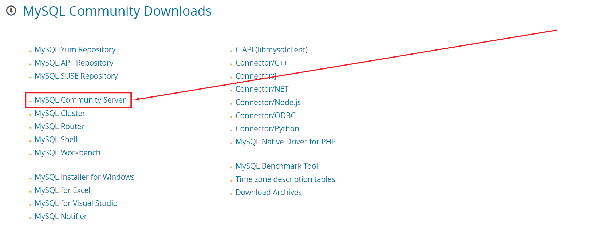

第四步：选择合适的版本


① GLIBC版本（相当于Windows中的绿色版）

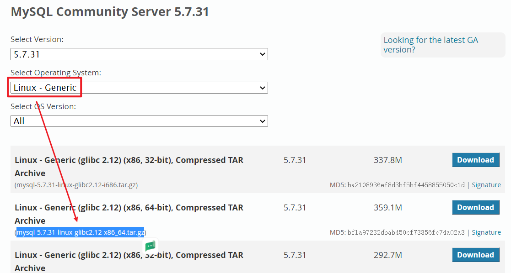

② 源码编译版本（需要源码编译三步走 => 配置 + 编译 + 安装）


# 二、CentOS7.6操作系统最小化安装

## 1、创建自定义虚拟机环境

第一步：选择自定义（根据需求设定服务器环境）

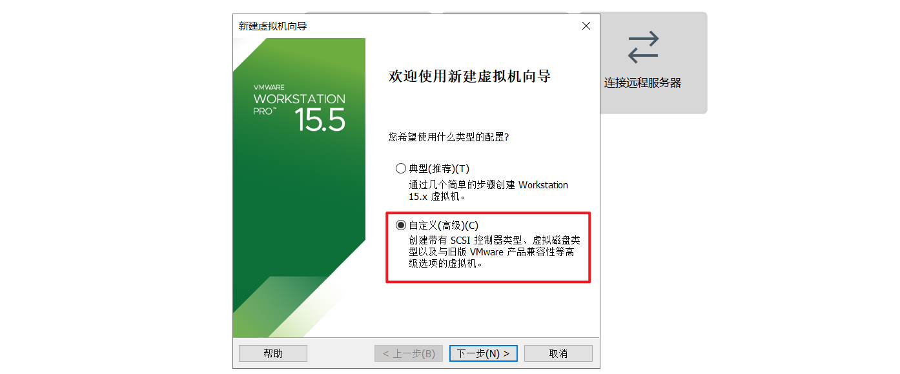

第二步：选择稍后安装操作系统

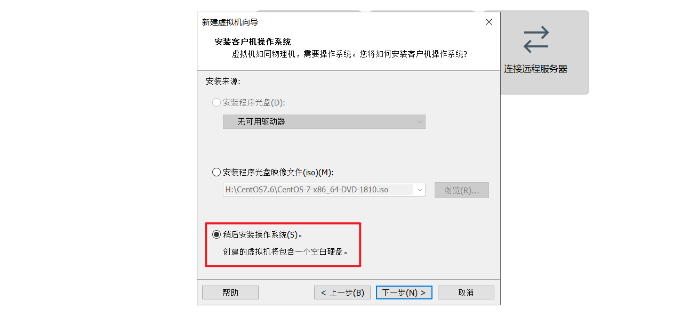

第三步：选择操作系统类型


第四步：设置虚拟机名称及路径（建议剩余空间大于等于20G）


第五步：设置CPU核数


第六步：设置MEM内存

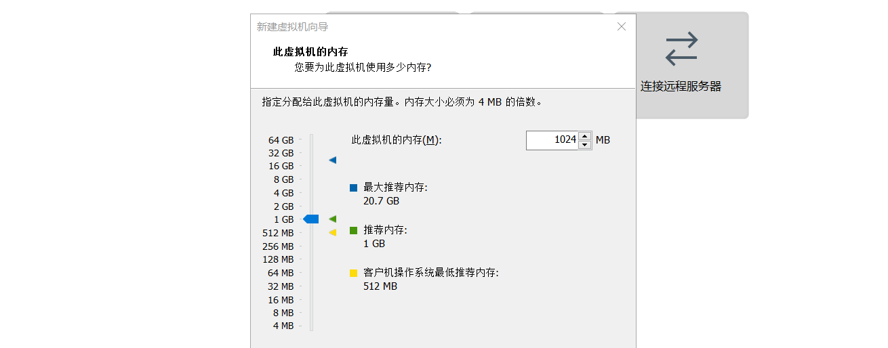

第七步：设置网络连接（NAT模式）


剩下的全部默认，一路下一步，直至设置完成！

## 2、安装CentOS7.6最小化模式

第一步：加载光盘镜像

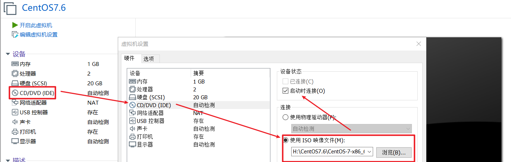

第二步：启动虚拟机，安装CentOS7.6


第三步：设置安装语言（必须选择全英文）

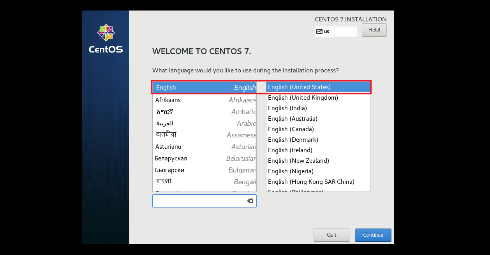

第四步：设置服务器时间（Asia/Shanghai）

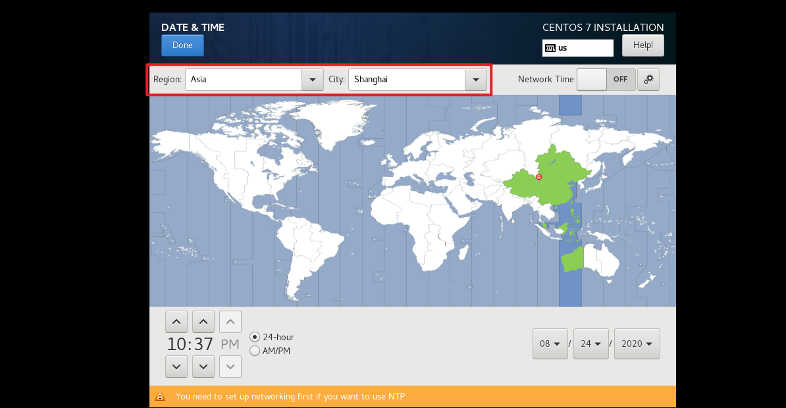

第五步：软件选择，最小化然后必须要勾选开发工具（里面主要是GCC编译器）


第六步：自动分区

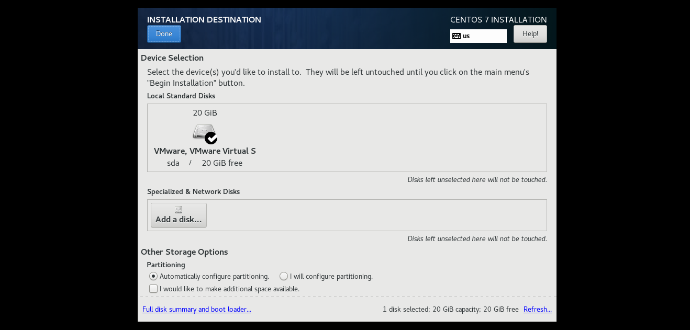

第七步：设置网络连接为自动连接（开机后，自动连接网络）

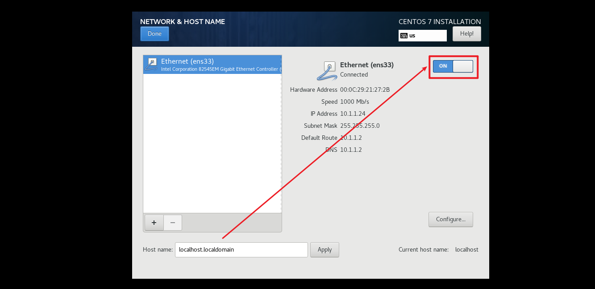

第八步：设置ROOT账号密码以及自定义用户（建议为itheima）

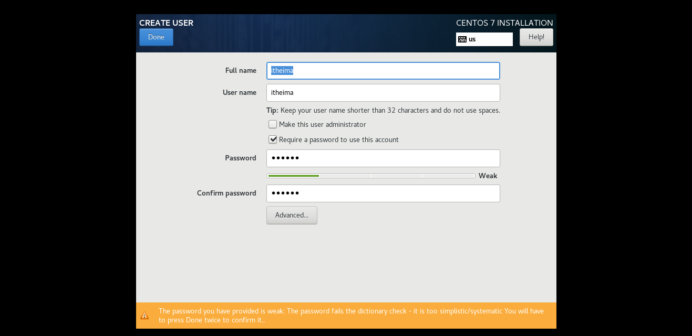

## 3、CentOS7.6操作系统最小化后续配置

① 设置主机名称

```powershell
# hostnamectl set-hostname centos7.itcast.cn
# su
```

② 更改IP获取方式为静态设置以及绑定主机名+IP到/etc/hosts

```powershell
# vi /etc/sysconfig/network-scripts/ifcfg-ens33
TYPE="Ethernet"
BOOTPROTO="none"
IPADDR=10.1.1.10
NETMASK=255.255.255.0
GATEWAY=10.1.1.2
DNS1=8.8.8.8
DNS2=119.29.29.29
NAME="ens33"
DEVICE="ens33"
ONBOOT="yes"

# vi /etc/hosts
10.1.1.10 centos7.itcast.cn

# systemctl restart network
如果是多网卡形式，建议使用ifdown与ifup
# ifdown ens33
# ifup ens33

# ip a
```

③ 关闭防火墙与SELinux

```powershell
# systemctl stop firewalld
# systemctl disable firewalld

# setenforce 0
# vim /etc/selinux/config
SELINUX=disabled
```

④ 配置公网YUM源（可以考虑腾讯）

```powershell
# yum install wget -y
# mv /etc/yum.repos.d/CentOS-Base.repo /etc/yum.repos.d/CentOS-Base.repo.backup
# wget -O /etc/yum.repos.d/CentOS-Base.repo http://mirrors.cloud.tencent.com/repo/centos7_base.repo

# yum clean all
# yum makecache
```

⑤ 安装扩展软件（bash-completion自动补全、vim编辑器、net-tools网络工具包以及ntpdate时间同步工具）

```powershell
# yum install bash-completion vim net-tools ntpdate -y
```

⑥ ntpdate时间同步 

```powershell
# ntpdate 120.25.108.11
```

## 4、拍摄快照：把CentOS7.6最小化系统做模板机

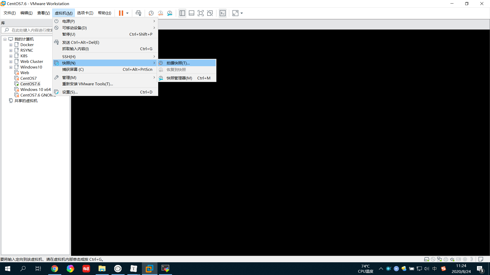


> 拍摄快照完成后，这台机器就可以关机啦，以后专门充当克隆用的母机！

# 三、MySQL的安装的几种方式

## 1、MySQL安装方式

二进制软件包安装

① yum安装或rpm安装（略）

② glibc版本安装（相当于Windows中的绿色软件）

命名：==mysql-5.7.31-linux-glibc2.12-x86_64.tar.gz== 

依赖[^glibc]库，可以安装在通用的Linux系统下

源码包编译安装

命名：mysql-5.7.31.tar.gz，通用的Linux下都可以编译安装。

## 2、三种安装方式的区别

| 安装方式 | 优点                             | 缺点                                      |
| -------- | -------------------------------- | ----------------------------------------- |
| rpm      | 安装卸载简单                     | 可定制性差                                |
| glibc    | 可定制性相比rpm包灵活些          | 安装相比rpm包复杂些，需要手动初始化数据库 |
| 源码安装 | 可定制性最强，根据需求和功能定制 | 安装麻烦，需要手动初始化数据库            |

> 在企业中，数据库的安装很少使用rpm方式，大部分都是基于源码安装以及glibc安装！

## 3、区分数据库与数据库实例

#### ㈠ 什么是MySQL数据库？

**数据库（database）：** 操作系统或存储上的==数据文件的集合==。mysql数据库中，数据库文件可以是* .frm、*.MYD、*.MYI、*.ibd等结尾的文件， 不同存储引擎文件类型不同。

#### ㈡ 什么是MySQL数据库实例？

**数据库实例（instance）：** 由==后台进程或者线程==以及一个==共享内存区==组成。共享内存可以被运行的后台线程所共享。 数据库实例才是真正操作数据库的。

注意：MySQL的后台守护程序==mysqld==是单进程多线程的工作模式。

#### ㈢ 什么是MySQL数据库服务器？

**数据库服务器(database server)：**部署==安装数据库实例==的服务器。

#### ㈣ 数据库和数据库实例之间的关系是什么？

通常情况下，数据库实例和数据库是一一对应的关系，也就是==一个数据库实例对应一个数据库==； 但是，在集群环境中存在==多个数据库实例共同使用一个数据库==。oracle RAC

# 四、MySQL的GLIBC版本安装

## 1、获取MySQL GLIBC版本

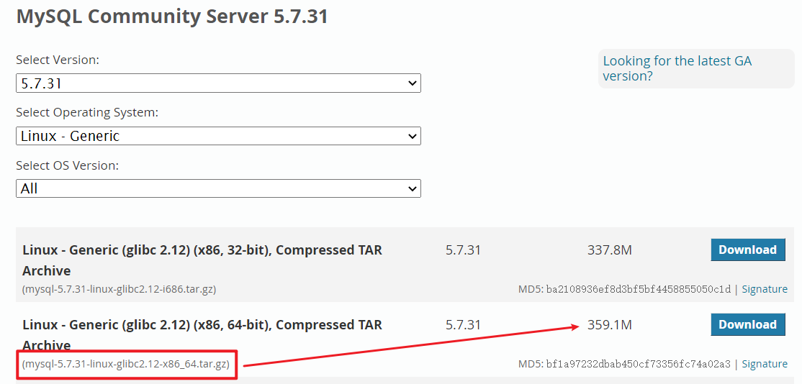

## 2、学会看官方文档

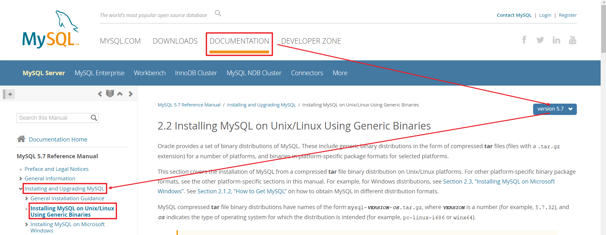

## 3、安装MySQL依赖库软件

第一步：克隆模板机，生成MySQL服务器

第二步：启动系统

第三步：更改主机名称为mysql.itcast.cn，然后重启网络

第四步：拍摄快照

第五步：安装依赖库libaio库

```powershell
# yum install libaio -y
```

## 4、上传软件包解压，了解目录结构

```powershell
# tar -xf mysql-5.7.31-linux-glibc2.12-x86_64.tar.gz
# ls mysql-5.7.31-linux-glibc2.12-x86_64
```

解压完成后，目录结构如下图所示：

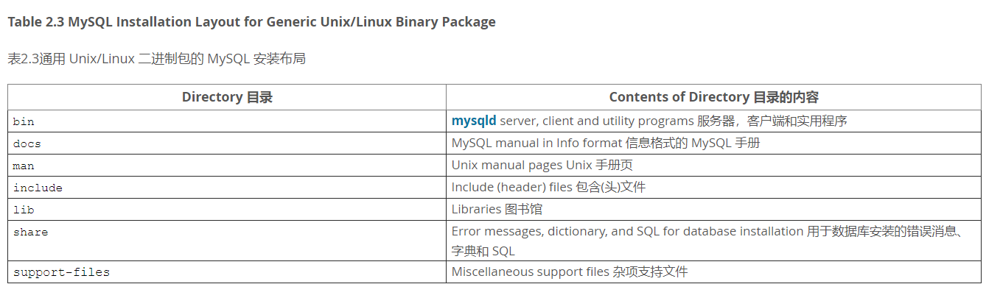

安装需求：

| 选项     | 值（自定义也可以采用默认形式） |
| -------- | ------------------------------ |
| 安装路径 | /mysql_3306                    |
| 数据路径 | /mysql_3306/data               |
| 端口号   | 3306                           |

## 5、软件的安装（查看官方说明）

https://dev.mysql.com/doc/refman/5.7/en/binary-installation.html


第一步：创建一个数据库专用账号mysql（其所属组也为mysql）

```powershell
# useradd -r -s /sbin/nologin mysql
# id mysql
```

第二步：清空系统中的原有mariadb的配置文件(/etc/my.cnf)

```powershell
# rm -rf /etc/my.cnf
```

第三步：把mysql解压后的压缩包（GBLIC版本）移动到/根目录下，然后更名为mysql_3306

```powershell
# mv mysql-5.7.31-linux-glibc2.12-x86_64 /mysql_3306
```

第四步：切换到mysql工作目录/mysql_3306，创建一个mysql-files

```powershell
# cd /mysql_3306
# mkdir mysql-files
```

第五步：更改mysql-files权限

```powershell
# chown mysql:mysql mysql-files
# chmod 750 mysql-files
```

第六步：初始化数据库（可以实现数据库的初始化，而且会产生一个==随机密码==）

```powershell
# bin/mysqld --initialize --user=mysql --basedir=/mysql_3306
选项说明：
--initialize 	 初始化（真正开始干活）
--user=mysql 	 以mysql用户的身份初始化数据库，产生文件都是mysql作为拥有者
--basedir=xxx    mysql其安装目录，非常重要

运行完毕后，观察最后一行，保存root账号的密码，以备后期使用。
2020-08-24T06:46:24.889735Z 1 [Note] A temporary password is generated for root@localhost: (cn_jS+*n2wh
```

> 经验之谈：想查看mysql软件有没有初始化成功，主要看mysql目录下有没有产生data文件夹且文件夹中至少要有一个mysql的文件夹。

第七步：设置安全加密连接（SSL），数据传输会采用加密形式，适合敏感数据

```powershell
# bin/mysql_ssl_rsa_setup --datadir=/mysql_3306/data
```

第八步：启动MySQL数据库

```powershell
# cp support-files/mysql.server /etc/init.d/mysql_3306
```

> 注：默认情况下，GBLIC版本的数据库要求安装到/usr/local/mysql目录，其mysql.server脚本中对应的目录也是/usr/local/mysql，这会导致mysql无法启动。所以可以更改其basedir以及datadir两个变量

```powershell
# vim /etc/init.d/mysql_3306
46行 basedir=/mysql_3306
47行 datadir=/mysql_3306/data
```

第九步：启动MySQL数据库（不能使用systemctl，只能使用service）

```powershell
# service mysql_3306 start
Starting MySQL.Logging to '/mysql_3306/data/mysql.itcast.cn.err'.
```

> 特别说明：当MySQL启动成功后，其日志会自动写入到data数据目录中的主机名称.err文件中，这个文件一定要多看，涉及MySQL无法启动、启动报错，其详细的原因99%在.err文件中可以找到问题所在！

## 6、软件的安装常见问题答疑

问题1：为什么一定要删除/etc/my.cnf文件，不删除有何影响？

答：/etc/my.cnf文件是操作系统为mariadb软件预留的配置的文件，之所以一定要删除这个文件，主要原因在于数据库在初始化时，首先在自己的安装目录下寻找有没有my.cnf配置文件，如果有，会自动根据里面的配置信息进行初始化。如果找不到，则到/etc目录下寻找my.cnf文件，如果有，依然会按照其内部的配置进行初始化，但是由于/etc目录下的my.cnf文件是mariadb的，这会导致我们的初始化如果按照mariadb的配置，会导致初始化失败。


问题2：mysql-files文件夹到底干什么的？

答：目前mysql-files没有什么用，但是你必须要创建，因为GLIBC属于二进制软件包，其很多配置已经默认了，包括mysql-files文件夹，如果没有这个文件夹可能导致mysql无法启动。

> mysql-files：主要用于数据文件的导入与导出（备份与还原），MySQL的备份会产生一个文件，可以xxx.sql或xxx.txt。mysql-files就是导入与导出时，所指定的默认目录。


问题3：到底怎么判断数据库是否初始化成功了？

答：数据库的安装容易出错的地方就是初始化，一旦初始化失败了，数据库100%启动报错。如何确认数据库是否初始化成功了呢？主要看安装目录下有没有生成一个==data==的文件夹。

>一定要看准一点，文件夹名称叫data（数据目录），不是date（时间）


问题4：为什么一定要把mysql.server放在/etc/init.d目录下，不放行不行？

答：不放也可以，但是这个时候就不能使用service命令启动以及添加到开机启动项了。只能通过bin/mysqld_safe脚本启动数据库。

> /etc/init.d是CentOS6以及早期版本中的服务脚本目录，只要把Shell启动脚本放在这个目录下，你就可以使用service进行管理。


问题5：为什么一定要改变/etc/init.d/mysql_3306中的basedir与datadir？

答：GLIBC版本属于二进制版本，默认已经配置了很多内容，包括默认的安装路径/usr/local/mysql，一旦你的mysql没有安装在这个目录下，则必须手工设置basedir以及datadir其位置，否则脚本无法启动mysql程序


问题6：如何让mysql自动启动？

```powershell
# chkconfig --list				查询系统中的所有开机启动项
# chkconfig --add mysql_3306    必须与/etc/init.d目录下的脚本名称一致
# chkconfig mysql_3306 on		把2345四种模式全部开启（3字符界面，5图形界面）
```

> CentOS6及以前版本中，控制服务的开机启动的

## 7、MySQL GLIBC版本后续配置

第一步：更改管理员root账号的密码

- **方法1：**

```powershell
[root@node1 mysql_3306]# bin/mysqladmin -uroot password '123' -p
Enter password:输入刚刚初始化产生的临时密码
```

- **方法2**

```powershell
mysql> set password=password('456');   		//未来版本将会弃用
或者
mysql> set password='123';					//推荐

重置完成后，建议刷新权限，让其立即生效
mysql> flush privielges;
```

第二步：把mysql客户端命令添加到环境变量，以后随时可以访问

```powershell
# echo 'export PATH=$PATH:/mysql_3306/bin' >> /etc/profile
# source /etc/profile

设置完成后，我们可以在任意位置调用mysql客户端命令
# mysql -uroot -p
Enter password:123
```

第三步：手工定义MySQL的配置文件（非常重要）

```powershell
# vim /mysql_3306/my.cnf
[mysqld]
basedir=/mysql_3306
datadir=/mysql_3306/data
socket=/tmp/mysql.sock
选项说明：
[mysqld]	代表针对服务器端进行配置
basedir		代表数据库的安装目录
datadir		代表数据目录，以后专门用于存放数据文件的（核心目录）
socket		代表套接字文件，专门为客户端与服务器端连接提供一个桥梁

# service mysql_3306 restart
```

> C(Client) === mysql命令   连（socket套接字）接   mysqld服务器端程序

第四步：安全配置（对于生产环境比较重要）

```powershell
# mysql_secure_installation
```

一路Y，搞定！

> 其主要就是是否启动密码脚尖器、是否设置root密码、是否允许root远程连接、是否移除测试数据库等等一系列功能。

常见问题：如何关闭MySQL密码强度检测？

```powershell
# vim /mysql_3306/my.cnf
[mysqld]
...
validate_password=OFF

# service mysql_3306 restart
```

# 五、MySQL的源码编译安装

## 1、参考MySQL源码安装官方文档

官方文档：https://dev.mysql.com/doc/refman/5.7/en/source-configuration-options.html

**源码安装三步曲：配置——>编译——>安装**

####㈠ 安装须知

- 软件包介绍

~~~powershell
mysql-boost-5.7.31.tar.gz						可在任意发行版的Linux下安装
~~~

#### ㈡  安装需求

| 安装需求            | 具体配置            |
| ------------------- | ------------------- |
| 安装目录（basedir） | /mysql_3307         |
| 数据目录（datadir） | /mysql_3307/data    |
| 端口号              | 3307                |
| socket文件位置      | $basedir/mysql.sock |
| 字符集              | utf8mb4             |

####㈢ ==了解配置选项==

- 常用配置选项

| 配置选项             | 描述                             | 默认值            | 建议值                                  |
| -------------------- | -------------------------------- | ----------------- | --------------------------------------- |
| CMAKE_INSTALL_PREFIX | 安装基目录(basedir)              | /usr/local/mysql  | 根据需求                                |
| MYSQL_DATADIR        | 数据目录(datadir)                | $basedir/data     | 根据需求                                |
| SYSCONFDIR           | 默认配置文件my.cnf路径           |                   | /etc                                    |
| MYSQL_TCP_PORT       | TCP/IP端口                       | 3306              | 非默认端口                              |
| MYSQL_UNIX_ADDR      | 套接字socket文件路径             | /tmp/mysql.sock   | $basedir/                               |
| DEFAULT_CHARSET      | 默认字符集                       | latin1            | **utf8mb4**                             |
| DEFAULT_COLLATION    | 默认校验规则                     | latin1_swedish_ci | utf8mb4_general_ci                      |
| WITH_EXTRA_CHARSETS  | 扩展字符集                       | all               | all                                     |
| ENABLED_LOCAL_INFILE | 是否启用本地加载外部数据文件功能 | OFF               | 建议开启                                |
| WITH_SSL             | SSL支持类型                      | system            | 建议显式指定                            |
| WITH_BOOST           | Boost库源代码的位置              |                   | Boost库是构建MySQL所必需的,建议事先下载 |

- 存储引擎相关配置项

**说明：**

以下选项值均为布尔值，0或1；0代表不编译到服务器中，1代表编译，建议都静态编译到服务器中。

其他的存储引擎可以根据实际需求在安装时通过WITH_xxxx_STORAGE_ENGINE=1的方式编译到服务器中。

| 配置选项                      | 描述                                                         |
| ----------------------------- | ------------------------------------------------------------ |
| WITH_INNOBASE_STORAGE_ENGINE  | 将InnoDB存储引擎插件构建为静态模块编译到服务器中；建议编译到服务器中 |
| WITH_PARTITION_STORAGE_ENGINE | 是否支持分区                                                 |
| WITH_FEDERATED_STORAGE_ENGINE | 本地数据库是否可以访问远程mysql数据                          |
| WITH_BLACKHOLE_STORAGE_ENGINE | 黑洞存储引擎，接收数据，但不存储，直接丢弃                   |
| WITH_MYISAM_STORAGE_ENGINE    | 将MYISAM存储引擎静态编译到服务器中                           |

## 2、MySQL的源码编译安装

> 建议大家在源码编译安装之前，先拍摄一个快照

第一步：安装MySQL编译需要用到的依赖库

```powershell
# yum -y install ncurses-devel cmake libaio-devel openssl-devel
```

第二步：上传软件到服务器端并解压

```powershell
# tar -xf mysql-boost-5.7.31.tar.gz
# cd mysql-5.7.31
```

第三步：配置（基于cmake进行配置）

```powershell
# vim myconfig.sh
cmake . \
-DCMAKE_INSTALL_PREFIX=/mysql_3307 \
-DMYSQL_DATADIR=/mysql_3307/data \
-DMYSQL_TCP_PORT=3307 \
-DMYSQL_UNIX_ADDR=/mysql_3307/mysql.sock \
-DWITH_INNOBASE_STORAGE_ENGINE=1 \
-DWITH_PARTITION_STORAGE_ENGINE=1 \
-DWITH_FEDERATED_STORAGE_ENGINE=1 \
-DWITH_BLACKHOLE_STORAGE_ENGINE=1 \
-DWITH_MYISAM_STORAGE_ENGINE=1 \
-DENABLED_LOCAL_INFILE=1 \
-DEXTRA_CHARSETS=all \
-DDEFAULT_CHARSET=utf8mb4 \
-DDEFAULT_COLLATION=utf8mb4_general_ci \
-DWITH_SSL=system \
-DWITH_BOOST=boost
# chmod +x myconfig.sh
# ./myconfig.sh

选项说明：
-DCMAKE_INSTALL_PREFIX ：安装路径
-DMYSQL_DATADIR ：数据目录
-DMYSQL_TCP_PORT ：端口号
-DMYSQL_UNIX_ADDR ：套接字文件位置
```

第四步：编译安装

```powershell
# make -j2 && make install
选项说明：
-j2 ：代表同时开启多个线程共同实现编译操作
```

## 3、编译报错常见问题解析

问题1：没有boost导致安装失败

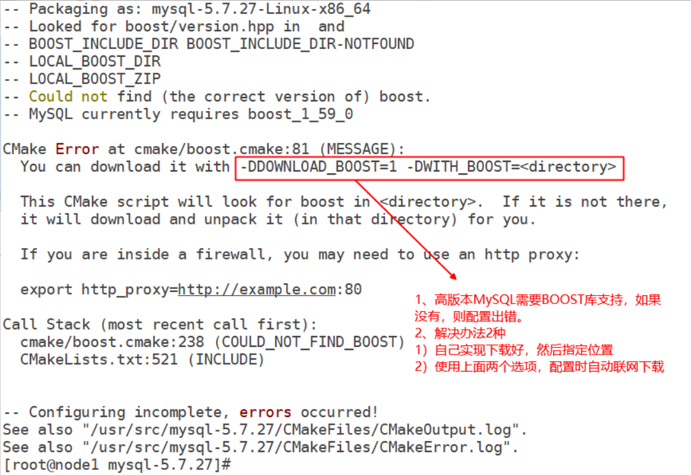

问题2：编译安装中途报错

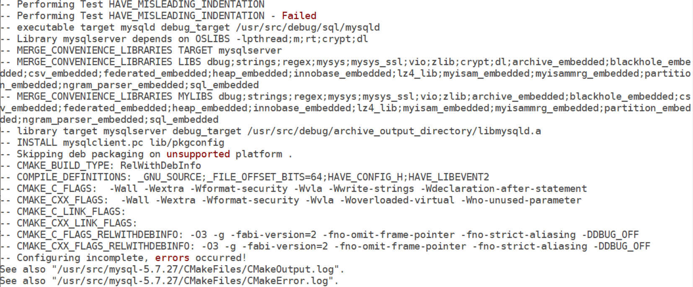

解决方案：只能重新编译一下

```powershell
# rm -f CMakeCache.txt
# make -j2 && make install
```

## 4、MySQL数据库的初始化

**注意：**进入到==安装目录==里/mysql_3307

```powershell
# cd /mysql_3307
```

第一步：创建mysql-files目录

```powershell
创建系统变量`secure_file_priv`限制导入导出目录并修改权限
# mkdir mysql-files
# chown -R mysql:mysql /mysql_3307
# chmod 750 mysql-files
```

第二步：数据库初始化操作

```powershell
# bin/mysqld --initialize --user=mysql --basedir=/mysql_3307 --datadir=/mysql_3307/data
...
2020-08-24T11:07:37.621346Z 1 [Note] A temporary password is generated for root@localhost: O6.iHqrZgzz7
```

第三步：拷贝mysql.server脚本到/etc/init.d目录，然后启动数据库

```powershell
# cp support-files/mysql.server /etc/init.d/mysql_3307
# service mysql_3307 start
```

启动异常的解决方案：

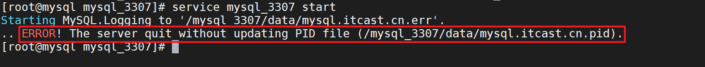

查看mysql.itcast.cn.err这个错误日志

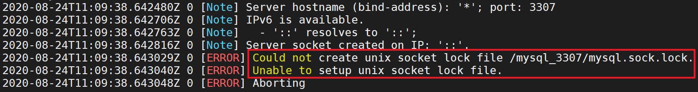

出现以上问题的主要原因在于mysql这个用户对/mysql_3307目录没有写入文件的权限，写入mysql_socket套接字文件。

解决方案：

```powershell
# chown -R mysql.mysql /mysql_3307
```

## 5、MySQL源码编译安装后的后续配置

第一步：编写MySQL配置文件，my.cnf

```powershell
# vim /mysql_3307/my.cnf
[mysqld]
basedir=/mysql_3307
datadir=/mysql_3307/data
socket=/mysql_3307/mysql.sock

# service mysql_3307 restart
```

第二步：设置管理员的密码

```powershell
# bin/mysqladmin -uroot password '123' -p
Enter password:O6.iHqrZgzz7
```

第三步：安全设置

```powershell
# bin/mysql_secure_installation
```

第四步：添加mysql_3307到开机启动项

```powershell
# chkconfig --add mysql_3307
# chkconfig mysql_3307 on
```

# 六、MySQL常见问题解决方案

## 1、如何访问不同的数据库？

**方法一：**直接使用==**对应的客户**==端软件访问

```powershell
访问5.7.31版本数据库：
[root@node1 ~]# /mysql_3306/bin/mysql -uroot -p
Enter password:
Welcome to the MySQL monitor.  Commands end with ; or \g.
Your MySQL connection id is 3
Server version: 5.7.31 MySQL Community Server (GPL)

访问5.7.31版本数据库：
[root@node1 ~]# /mysql_3307/bin/mysql -uroot -p
Enter password:
Welcome to the MySQL monitor.  Commands end with ; or \g.
Your MySQL connection id is 7
Server version: 5.7.31 Source distribution

```

**方法二：**==定义别名==的方式访问

```powershell
[root@node1 ~]# alias mysql_3306="/mysql_3306/bin/mysql"
[root@node1 ~]# alias mysql_3307="/mysql_3307/bin/mysql"
[root@node1 ~]# mysql_3306 -uroot -p
Enter password:
Welcome to the MySQL monitor.  Commands end with ; or \g.
Your MySQL connection id is 4
Server version: 5.7.31 MySQL Community Server (GPL)

[root@node1 ~]# mysql_3307 -uroot -p
Enter password:
Welcome to the MySQL monitor.  Commands end with ; or \g.
Your MySQL connection id is 8
Server version: 5.7.27 Source distribution
```

**方法三：**==拷贝相应命令==到PATH可以识别的路径下==并重命名==

```powershell
[root@node1 ~]# unalias mysql_3306
[root@node1 ~]# unalias mysql_3307
+++++++++++++++++++++我是华丽分隔符+++++++++++++++++++++++++++
[root@node1 ~]# cp /mysql_3306/bin/mysql /usr/bin/mysql_3306
[root@node1 ~]# cp /mysql_3307/bin/mysql /usr/bin/mysql_3307
[root@node1 ~]# which mysql_3306
/usr/bin/mysql_3306
[root@node1 ~]# which mysql_3307
/usr/bin/mysql_3307
```

**深度思考：**我们之所以能够连接到数据库里的**==本质==**是什么？答：套接字

## 2、MySQL忘记密码的解决方案

**敲黑板：**找问题的解决方法很重要！

### 1、跳过授权表（通用）

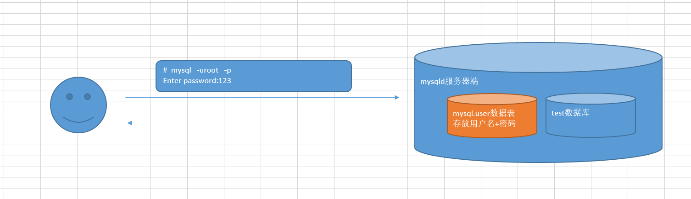

#### ㈠ 跳过授权表重启数据库（以GLIBC 3306为例）

##### ① 关闭数据库

```powershell
[root@node1 ~]# mysqladmin shutdown -p
Enter password:
```

##### ② 跳过授权表启动

**友情提示：**启动过程可能会一波三折，冷静分析看报错，必能解决！

```powershell
# /mysql_3306/bin/mysqld --defaults-file=/mysql_3306/my.cnf --skip-grant-tables --skip-networking=on  --user=mysql &
```

#### ㈡ 刷新授权表（重要）

```powershell
# mysql -uroot -p
Enter password:什么都不要输入，直接回车即可

mysql> flush privileges;
Query OK, 0 rows affected (0.00 sec)
```

#### ㈢ 修改密码

```powershell
mysql> alter user 'root'@'localhost' identified by '123';
Query OK, 0 rows affected (0.00 sec)
```

**==补充：==**如果未能成功，则使用以下语句修改密码

```powershell
mysql> UPDATE mysql.user SET authentication_string = PASSWORD('MyNewPass')
WHERE User = 'root' AND Host = 'localhost';
mysql> FLUSH PRIVILEGES;
```

修改密码后，使用jobs + kill命令，停止正在运行的mysqld进程。然后使用service启动服务

```powershell
# jobs
# kill %1

# service mysql_3306 start
```

### 2、Unix和类Unix系统重置（了解）

#### ㈠ 停止数据库

```powershell
[root@node1 ~]# mysqladmin shutdown -p
Enter password:
```

#### ㈡ 编写创建密码语句到文件

```powershell
# echo "ALTER USER 'root'@'localhost' IDENTIFIED BY '123';" >> /mysql_3306/mysql.pass
注意：该文件一定要对启动用户如mysql有所有权限
# chown -R mysql. /mysql_3306
```

#### ㈢ 指定密码文件启动数据库

```powershell
# mysqld --defaults-file=/mysql_3306/my.cnf --init-file=/mysql_3306/mysql.pass  --user=mysql &
```

#### ㈣ 删除密码文件，并测试

```powershell
# rm -f /mysql_3306/mysql.pass
# mysql -uroot -p
```
