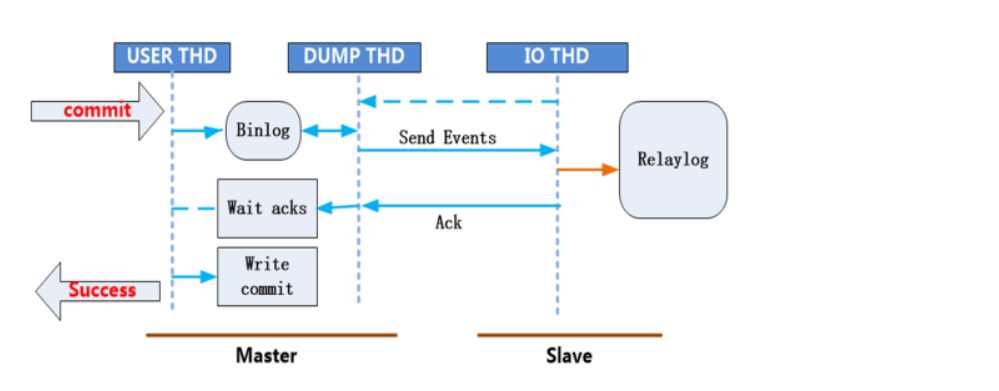
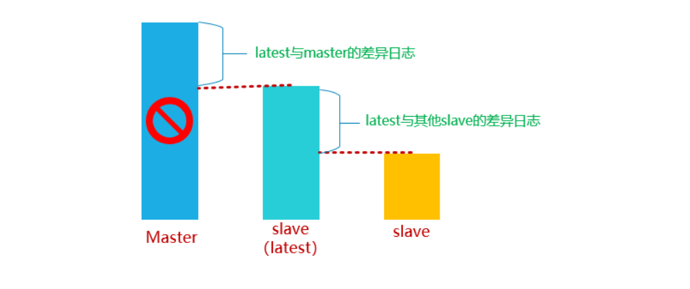
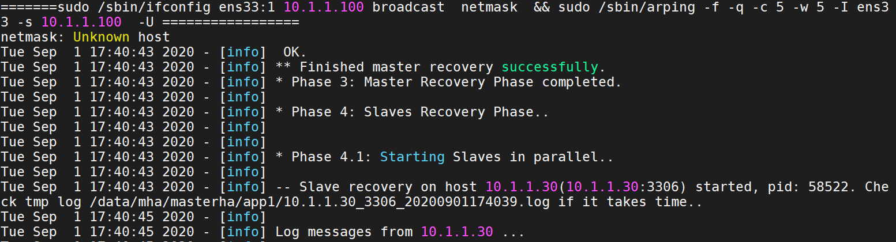

# 半同步复制与MHA高可用架构设计

# 一、半同步复制

## 1、什么是半同步复制



所谓的半同步复制就是master每commit一个事务(简单来说就是做一个改变数据的操作）,要确保slave接受完主服务器发送的binlog日志文件==并写入到自己的中继日志relay log里==，然后会给master信号，告诉对方已经接收完毕，这样master才能把事物成功==commit==。这样就保证了master-slave的==数据绝对的一致==（但是以牺牲==master的性能为代价==).但等待时间也是可以调整的。

## 2、半同步复制的基本实现

第一步：准备一套M-S的主从架构（建议使用基于GTIDs架构设计）

第二步：给MASTER与SLAVE安装plugin插件(`$basedir/lib/plugin/)

MASTER：

```powershell
mysql> install plugin rpl_semi_sync_master soname 'semisync_master.so';
mysql> show global variables like 'rpl_semi_sync%';
```

SLAVE：

```powershell
mysql> install plugin rpl_semi_sync_slave soname 'semisync_slave.so';
mysql> show global variables like 'rpl_semi_sync%';
```

第三步：激活MASTER与SLAVE服务器中的半同步复制插件

MASTER：

 ```powershell
mysql> set global rpl_semi_sync_master_enabled=on;
mysql> show global status like 'rpl_semi_sync%';
 ```

SLAVE：

```powershell
mysql> set global rpl_semi_sync_slave_enabled=on;
mysql> show global variables like 'rpl_semi_sync%';
```

第四步：在SLAVE服务器中重启IO线程

```powershell
mysql> stop slave IO_THREAD;
mysql> start slave IO_THREAD;
```

第五步：测试验证半同步复制

当slave从库的IO_Thread 线程将binlog日志接受完毕后，要给master一个确认，如果超过10s未收到slave的接收确认信号，那么就会自动转换为传统的异步复制模式。

1）master插入一条记录，查看slave是否有成功返回

```powershell
mysql> insert into db_itheima.tb_student values (null,'j');
mysql> show global status like 'rpl_semi_sync%_yes_tx'; 
+-----------------------------+-------+
| Variable_name               | Value |
+-----------------------------+-------+
| Rpl_semi_sync_master_yes_tx |  1    |
表示这次事物成功从slave返回一次确认信号
+-----------------------------+-------+
```

2）模拟slave服务器故障

SLAVE：

```powershell
# service mysqld stop
```

MASTER：

```powershell
mysql> insert into db_itheima.tb_student values (null,'k'); 
mysql> insert into db_itheima.tb_student values (null,'l'); 
这次插入一个值需要等待10秒（默认的等待时间)
mysql> insert into db_itheima.tb_student values (null,'m'); 
现在自动转成了原来的异步模式
```

3）重新启动半同步复制

SLAVE：

```powershell
# service mysqld start
# mysql -P 3310 -p
mysql> set global rpl_semi_sync_slave_enabled=on;
mysql> stop slave IO_THREAD;
mysql> start slave IO_THREAD;
```

master需要等到slave确认后才能提交，如果等不到确认消息，master等待10s种后自动变成异步同步;slave启起来后，master上改变的数据还是会自动复制过来，数据又回到一致。

## 3、等待时间的修改（默认10s）

```powershell
mysql> set global rpl_semi_sync_master_timeout=3600000;
mysql> show global variables like 'rpl_semi_sync%';
+------------------------------------+---------+
| Variable_name                      | Value   |
+------------------------------------+---------+
| rpl_semi_sync_master_enabled       | ON      |
| rpl_semi_sync_master_timeout       | 3600000 |
| rpl_semi_sync_master_trace_level   | 32      |
| rpl_semi_sync_master_wait_no_slave | ON      |
+------------------------------------+---------+
```

## 4、卸载半同步复制插件（不需要时）

```powershell
mysql> select plugin_name,load_option from information_schema.plugins;
mysql> uninstall plugin 插件名称;
```

## 补充：mysqld重启后，需要手工启动主从同步

```powershell
# service mysqld stop
# service mysqld start
# mysql -P 3310 -p
mysql> show slave status\G
Slave_IO_Running: No
Slave_SQL_Running: No
```

以上情况代表，mysqld重启后，主从同步也会随之关闭，需要手工开启。

```powershell
mysql> start slave;
```

# 二、MHA简介

## 1、什么是MHA

MHA（Master High Availability）目前在MySQL高可用方面是一个相对成熟的解决方案，它由日本DeNA公司youshimaton（现就职于Facebook公司）开发，是一套优秀的作为MySQL高可用性环境下==故障切换和主从提升==的高可用软件。在MySQL故障切换过程中，MHA能做到在0~30秒之内自动完成数据库的故障切换操作，并且在进行故障切换的过程中，MHA能在==较大程度==上保证数据的一致性，以达到真正意义上的高可用。

## 2、MHA工作原理



1. 当master出现故障时，通过对比slave之间I/O线程读取master上binlog的位置，选取最接近的slave做为最新的slave（latest slave）。 
2. 其它slave通过与latest slave对比==生成差异中继日志，并应用==。
3. 在latest slave上==应用从master保存的binlog==，同时将latest slave==提升为master==。
4. 最后在其它slave上应用相应的差异中继日志并开始从新的master开始复制.

## 3、MHA组件

- **MHA Manager**(管理节点) 

  MHA Manager可以单独部署在一台独立的机器上管理多个==master-slave集群==，也可以部署在一台slave节点上。

- **MHA Node**（数据节点）

  MHA Node运行在==每台MySQL服务器==上，MHA Manager会定时探测集群中的master节点，当master出现故障时，它可以自动将数据的slave提升为新的master，然后将所有其他的slave重新指向新的master。整个故障转移过程对应用程序完全透明。

## 4、MHA组件介绍

- MHA Manager

 运行一些工具，比如masterha_manager工具实现==自动监控MySQL Master==和实现==master故障切换==，其它工具手动实现master故障切换、在线mater转移、连接检查等等。一个Manager可以管理多 个master-slave集群

- MHA Node

 部署在所有运行MySQL的服务器上，无论是master还是slave。主要有三个作用：

1）保存二进制日志

 	如果能够访问故障master，会拷贝master的二进制日志

 2）应用差异中继日志

​	从拥有最新数据的slave上生成差异中继日志，然后应用差异日志。

 3）清除中继日志

 	在不停止SQL线程的情况下删除中继日志

## 5、MHA中工具介绍

#### ㈠ Manager工具

| 工具                      | 说明                       |
| ------------------------- | -------------------------- |
| ==masterha_check_ssh==    | 检查MHA的SSH配置           |
| ==masterha_check_repl==   | 检查MySQL复制              |
| ==masterha_manager==      | 启动MHA                    |
| ==masterha_check_status== | 检测当前MHA运行状态        |
| masterha_master_monitor   | 监测master是否宕机         |
| masterha_master_switch    | 控制故障转移(自动或手动)   |
| masterha_conf_host        | 添加或删除配置的server信息 |

#### ㈡ Node工具

| 工具                  | 说明                                            |
| --------------------- | ----------------------------------------------- |
| save_binary_logs      | 保存和复制master的二进制日志                    |
| apply_diff_relay_logs | 识别差异的中继日志事件并应用于其它slave         |
| filter_mysqlbinlog    | 去除不必要的ROLLBACK事件(MHA已不再使用这个工具) |
| purge_relay_logs      | 清除中继日志(不会阻塞SQL线程)                   |

*==注意：Node这些工具通常由MHA Manager的脚本触发,无需人手操作==。*

# 三、MHA部署架构

## 1、部署规划

| 角色               | IP        | 主机名           | server-id | 功能     | 备注 |
| ------------------ | --------- | ---------------- | --------- | -------- | ---- |
| MHA-Manager        | 10.1.1.40 | mha.itcast.cn    | —         | 管理节点 |      |
| MHA-Node（Master） | 10.1.1.10 | master.itcast.cn | 10        | 数据节点 | 写   |
| MHA-Node（Slave1） | 10.1.1.20 | slave1.itcast.cn | 20        | 数据节点 | 读   |
| MHA-Node（Slave2） | 10.1.1.30 | slave2.itcast.cn | 30        | 数据节点 | 读   |

##2、系统和软件版本

| 系统版本    | MySQL版本    | MHA版本                                         |
| ----------- | ------------ | ----------------------------------------------- |
| CentOS  7.6 | MySQL-5.7.31 | mha4mysql-manager-0.57      mha4mysql-node-0.57 |

## 3、系统环境初始化

第一步：克隆机器，首先启动MASTER，然后在一次启动SLAVE1、SLAVE2以及MHA

第二步：更改计算机的主机名称

```powershell
# hostnamectl set-hostname master.itcast.cn
# su

# hostnamectl set-hostname slave1.itcast.cn
# su

# hostnamectl set-hostname slave2.itcast.cn
# su

# hostnamectl set-hostname mha.itcast.cn
# su
```

第三步：更改IP地址以及绑定主机名称及IP地址到/etc/hosts文件

```powershell
# vim /etc/sysconfig/network-scripts/ifcfg-ens33
...
IPADDR=10.1.1.10、IPADDR=10.1.1.20、IPADDR=10.1.1.30、IPADDR=10.1.1.40
...

# systemctl stop NetworkManager
# systemctl disable NetworkManager

# systemctl restart network
```

使用MX连接4台服务器，绑定IP地址与主机名称到/etc/hosts文件中

```powershell
# vim /etc/hosts
10.1.1.10 master.itcast.cn
10.1.1.20 slave1.itcast.cn
10.1.1.30 slave2.itcast.cn
10.1.1.40 mha.itcast.cn
```

第四步：关闭防火墙与SELinux

```powershell
# systemctl stop firewalld
# systemctl disable firewalld
# setenforce 0
# sed -i '/SELINUX=enforcing/cSELINUX=disabled' /etc/selinux/config
```

第五步：配置YUM源

基础源（略，建议使用腾讯源）

配置epel源

```powershell
# wget -O /etc/yum.repos.d/epel.repo http://mirrors.cloud.tencent.com/repo/epel-7.repo
# yum clean all
# yum makecache
```

配置本地自建仓库的yum源

① 上传mha-yum软件包到/soft/mha目录

```powershell
# mkdir -p /soft/mha
```

② 配置本地yum源，当我们使用yum时，可以自动找到mha-yum这个仓库目录

```powershell
# vim /etc/yum.repos.d/local.repo
[mha]
name=mha soft
baseurl=file:///soft/mha/mha-yum
enabled=1
gpgcheck=0
```

测试MHA依赖软件库的安装

```powershell
yum -y install perl-DBD-MySQL \
perl-Config-Tiny \
perl-Time-HiRes \
perl-Mail-Sender \
perl-Mail-Sendmail \
perl-MIME-Base32 \
perl-MIME-Charset \
perl-MIME-EncWords \
perl-Params-Classify \
perl-Params-Validate.x86_64 \
perl-Log-Dispatch \
perl-Parallel-ForkManager \
net-tools
```

第六步：ntpdate时间同步（非常重要）

```powershell
# ntpdate 182.92.12.11
```

## 4、部署MySQL主从复制环境

数据库安装位置：/usr/local/mysql

数据库的数据目录：/usr/local/mysql/data

套接字文件：/tmp/mysql.sock

端口设置：3306

配置文件位置：/usr/local/mysql/my.cnf（MySQL => 安装目录下 => /etc目录下）

### ☆ MASTER主服务器

第一步：上传软件到/root目录

第二步：使用脚本安装MySQL软件

```powershell
# vim mysql.sh
#!/bin/bash
yum install libaio -y
tar -xf mysql-5.7.31-linux-glibc2.12-x86_64.tar.gz
mv mysql-5.7.31-linux-glibc2.12-x86_64 /usr/local/mysql
useradd -r -s /sbin/nologin mysql
rm -rf /etc/my.cnf
cd /usr/local/mysql
mkdir mysql-files
chown mysql:mysql mysql-files
chmod 750 mysql-files
bin/mysqld --initialize --user=mysql --basedir=/usr/local/mysql &> /root/password.txt
bin/mysql_ssl_rsa_setup --datadir=/usr/local/mysql/data
cp support-files/mysql.server /etc/init.d/mysqld
service mysqld start
echo 'export PATH=$PATH:/usr/local/mysql/bin' >> /etc/profile
source /etc/profile

# source mysql.sh
```

第三步：设置MySQL密码

```powershell
# mysql -p
mysql> set password='123';
mysql> flush privileges;
```

第四步：进行安全初始化

```powershell
# mysql_secure_installation
```

第五步：编写MASTER主机中my.cnf配置文件

```powershell
# vim /usr/local/mysql/my.cnf
[mysqld]
basedir=/usr/local/mysql
datadir=/usr/local/mysql/data
socket=/tmp/mysql.sock
port=3306
log-error=/usr/local/mysql/data/master.err
log-bin=/usr/local/mysql/data/binlog
server-id=10
character_set_server=utf8mb4
gtid-mode=on
log-slave-updates=1
enforce-gtid-consistency

# service mysqld restart
```

### ☆ SLAVE1/SLAVE2从服务器

第一步：上传MySQL软件到服务器端

第二步：使用脚本安装MySQL，但是不需要进行初始化

```powershell
# vim mysql.sh
#!/bin/bash
yum install libaio -y
tar -xf mysql-5.7.31-linux-glibc2.12-x86_64.tar.gz
rm -rf /usr/local/mysql
mv mysql-5.7.31-linux-glibc2.12-x86_64 /usr/local/mysql
useradd -r -s /sbin/nologin mysql
rm -rf /etc/my.cnf
cd /usr/local/mysql
mkdir mysql-files
chown mysql:mysql mysql-files
chmod 750 mysql-files
cp support-files/mysql.server /etc/init.d/mysqld
echo 'export PATH=$PATH:/usr/local/mysql/bin' >> /etc/profile
source /etc/profile

# source mysql.sh
```

第三步：使用rsync把MASTER服务器中的data数据目录同步到SLAVE1与SLAVE2

MASTER：

```powershell
# rm -rf /usr/local/mysql/data/auto.cnf
# rsync -av /usr/local/mysql/data root@10.1.1.20:/usr/local/mysql/
# rsync -av /usr/local/mysql/data root@10.1.1.30:/usr/local/mysql/
```

第四步：给SLAVE1与SLAVE2配置my.cnf文件

SLAVE1：

```powershell
# vim /usr/local/mysql/my.cnf
[mysqld]
basedir=/usr/local/mysql
datadir=/usr/local/mysql/data
socket=/tmp/mysql.sock
port=3306
log-error=/usr/local/mysql/data/slave1.err
log-bin=/usr/local/mysql/data/binlog
relay-log=/usr/local/mysql/data/relaylog
server-id=20
character_set_server=utf8mb4
gtid-mode=on
log-slave-updates=1
enforce-gtid-consistency
skip-slave-start
```

SLAVE2：

```powershell
# vim /usr/local/mysql/my.cnf
[mysqld]
basedir=/usr/local/mysql
datadir=/usr/local/mysql/data
socket=/tmp/mysql.sock
port=3306
log-error=/usr/local/mysql/data/slave2.err
log-bin=/usr/local/mysql/data/binlog
relay-log=/usr/local/mysql/data/relaylog
server-id=30
character_set_server=utf8mb4
gtid-mode=on
log-slave-updates=1
enforce-gtid-consistency
skip-slave-start
```

配置完成后，启动MySQL软件

```powershell
# service mysqld restart
```

### ☆ 配置主从数据同步

第一步：在MASTER服务器中创建一个slave同步账号

```powershell
mysql> create user 'slave'@'10.1.1.%' identified by '123';
mysql> grant replication slave on *.* to 'slave'@'10.1.1.%';
mysql> flush privileges;
```

第二步：创建一个mha账号（方便后期MHA监控主从同步状态）

```powershell
mysql> create user 'mha'@'10.1.1.40' identified by '123';
mysql> grant all privileges on *.* to 'mha'@'10.1.1.40';
mysql> flush privileges;
```

第三步：在SLAVE1与SLAVE2中配置主从数据同步

```powershell
mysql> change master to master_host='10.1.1.10',master_port=3306,master_user='slave',master_password='123',master_auto_position=1;

mysql> start slave;
mysql> show slave status\G
```

到此整个一主两从就配置完毕了！

## 5、MHA软件的安装

### ㈠ 不同节点安装软件

说明：在所有节点安装 ==mha-node== 软件包，在 ==mha 管理==端再安装 mha-manager 软件包

```powershell
[root@mha ~]# yum –y install mha4mysql-node-0.57-0.el7.noarch.rpm
[root@master ~]# yum –y install mha4mysql-node-0.57-0.el7.noarch.rpm
[root@slave1 ~]# yum -y install mha4mysql-node-0.57-0.el7.noarch.rpm
[root@slave2 ~]# yum –y install mha4mysql-node-0.57-0.el7.noarch.rpm

[root@mha ~]# yum –y install mha4mysql-manager-0.57-0.el7.noarch.rpm
```

> 如果已经提前安装依赖软件，则大家可以使用rpm -ivh直接安装

### ㈡ 配置ssh互信（免密登录）

说明：

1. 在生产环境中几乎都是禁止root远程登陆服务器的，所以ssh免密码登陆要在admin用户下进行配置，这是处于安全角度考虑出发。 
2. admin用户可以是任意普通用户
3. 该普通用户用于mha的管理节点远程访问mysql复制组中的所有主机，完成一些其他工作

第一步：在所有机器上创建一个普通账号admin，密码123

```powershell
# useradd admin
# echo 123|passwd --stdin admin
```

第二步：配置mha主机到其他主机的admin用户互信

```powershell
mha端：
[root@mha ~]# su - admin
[admin@mha ~]$ ssh-keygen -P "" -f ~/.ssh/id_rsa
[admin@mha ~]$ cd .ssh/
[admin@mha .ssh]$ ls
id_rsa  id_rsa.pub
[admin@mha .ssh]$ mv id_rsa.pub authorized_keys
[admin@mha .ssh]$ for i in 10 20 30;do scp -r ../.ssh/ 10.1.1.$i:~/;done

测试免密登录：
[admin@mha .ssh]$ ssh 10.1.1.10
[admin@mha .ssh]$ ssh 10.1.1.20
[admin@mha .ssh]$ ssh 10.1.1.30
```

> 疑问：SSH免密只需要拷贝公钥，但是以上代码是把整个.ssh目录拷贝过去了。
>
> 答：因为MHA的互信，要求不仅仅是MHA免密到MASTER、SLAVE1、SLAVE2，MASTER也要免密到MHA、SLAVE1、SLAVE2...

### ㈢ 配置admin用户的sudo权限

MASTER主机上：

```powershell
[root@master ~]# vim /etc/sudoers.d/admin
#User_Alias  表示具有sudo权限的用户列表; Host_Alias表示主机的列表
User_Alias MYSQL_USERS = admin
#Runas_Alias  表示用户以什么身份登录
Runas_Alias MYSQL_RUNAS = root
#Cmnd_Alias  表示允许执行命令的列表（命令需要使用完整路径）
Cmnd_Alias MYSQL_CMNDS = /sbin/ifconfig,/sbin/arping
MYSQL_USERS ALL = (MYSQL_RUNAS) NOPASSWD: MYSQL_CMNDS
```

把这个权限分发给SLAVE1与SLAVE2一份（当故障发生时，从服务器也可以自己设置VIP）

```powershell
[root@master ~]# for i in 20 30;do scp /etc/sudoers.d/admin 10.1.1.$i:/etc/sudoers.d/;done
```

测试admin用户是否可以挂载VIP（只能在MASTER机器上挂载VIP）

```powershell
# su - admin
[admin@master ~]$ sudo /sbin/ifconfig ens33:1 10.1.1.100 broadcast 10.1.1.255 netmask 255.255.255.0
[admin@master ~]$ sudo /sbin/arping -fqc 5 -w 5 -I ens33 -s 10.1.1.100 -U 10.1.1.10
[admin@master ~]$ ip a 

补充：
arping：用来向局域网内的其它主机发送ARP请求的指令，可以用来测试局域网内的某个IP是否已被使用。

-f：收到第一个响应包后退出。
-q：quite模式，不显示输出。 
-c：发送指定的count个ARP REQUEST包后停止。如果指定了-w参数，则会等待相同数量的ARP REPLY包，直到超时为止。
-w：指定一个超时时间，单位为秒，arping在到达指定时间后退出，无论期间发送或接收了多少包。在这种情况下，arping在发送完指定的count（-c）个包后并不会停止，而是等待到超时或发送的count个包都进行了回应后才会退出。 
-I：指定设备名，用来发送ARP REQUEST包的网络设备的名称。
-D：重复地址探测模式，用来检测有没有IP地址冲突，如果没有IP冲突则返回0。 
-s：设置发送ARP包的IP资源地址
-U：无理由的（强制的）ARP模式去更新别的主机上的ARP CACHE列表中的本机的信息，不需要响应。
-h：显示帮助页。 
```

### ㈣ 创建mha相关配置文件

MHA服务器：创建工作目录

```powershell
[root@mha ~]# mkdir /etc/mha/
[root@mha ~]# mkdir -p /data/mha/masterha/app1
[root@mha ~]# chown -R admin. /data/mha
```

创建mha局部配置文件：

```powershell
[root@mha ~]# vim /etc/mha/app1.conf
[server default]
# 设置监控用户和密码（修改1）
user=mha
password=123
# 设置复制环境中的复制用户和密码（修改2）
repl_user=slave
repl_password=123
# 设置ssh的登录用户名（修改3）
ssh_user=admin
# 设置监控主库,发送ping包的时间间隔,默认是3秒,尝试三次没有回应的时候自动进行failover
ping_interval=3
# 设置mgr的工作目录
manager_workdir=/data/mha/masterha/app1
# 设置mysql master保存binlog的目录,以便MHA可以找到master的二进制日志（修改4）
master_binlog_dir=/usr/local/mysql/data
# 设置master的pid文件（修改5）
master_pid_file=/usr/local/mysql/data/master.itcast.cn.pid
# 设置mysql master在发生切换时保存binlog的目录（在mysql master上创建这个目录）
remote_workdir=/data/mysql/mha
# 设置mgr日志文件（MHA遇到问题，主要看这个日志）
manager_log=/data/mha/masterha/app1/app1-3306.log
# MHA到master的监控之间出现问题,MHA Manager将会尝试从slave1和slave2登录到master上
secondary_check_script=/usr/bin/masterha_secondary_check -s 10.1.1.20 -s 10.1.1.30 --user=admin --port=22 --master_host=10.1.1.10 --master_port=3306
# 设置自动failover时候的切换脚本（故障发生时，自动挂载VIP到SLAVE1或SLAVE2）
master_ip_failover_script="/etc/mha/master_ip_failover.sh 10.1.1.100 1"
# 设置手动切换时候的切换脚本
#master_ip_online_change_script="/etc/mha/master_ip_online_change.sh 10.1.1.100 1"
# 设置故障发生后关闭故障主机脚本
# shutdown_script="/etc/mha/power_manager"
[server1]
hostname=10.1.1.10
port= 3306
candidate_master=1
[server2]
hostname=10.1.1.20
port= 3306
candidate_master=1
[server3]
hostname=10.1.1.30
port= 3306
candidate_master=1
```

### ㈤ 上传相应脚本/etc/mha目录，然后更改配置信息，授权

```powershell
[root@mha ~]# ls /etc/mha/
app1.conf  master_ip_failover.sh
注意：脚本内容中要修改网卡名字和连接用户为admin
my $vip  = shift;
my $interface = 'ens33';		网卡名（38行）
my $key = shift;
...
sub stop_vip() {
    my $ssh_user = "admin";		用户名（110行）
    print "=======$ssh_stop_vip==================\n";
    `ssh $ssh_user\@$orig_master_host \" $ssh_stop_vip \"`;
}

[root@mha ~]# chmod +x /etc/mha/master_ip_*
```

## 6、检测SSH互信以及MySQL主从状态

MHA：

```powershell
# su - admin
# 检测SSH互信
[admin@mha ~]$ masterha_check_ssh --conf=/etc/mha/app1.conf
# 检测集群状态
[admin@mha ~]$ masterha_check_repl --conf=/etc/mha/app1.conf
```

## 7、检查MHA状态，然后运行MHA（监控开始）

MHA：

```powershell
[admin@mha ~]$ masterha_check_status --conf=/etc/mha/app1.conf
app1 is stopped(2:NOT_RUNNING).

开启MHA Manager监控（关键，代表启动MHA）：
[admin@mha ~]$ nohup masterha_manager --conf=/etc/mha/app1.conf --remove_dead_master_conf --ignore_last_failover &

再次查看监控状态：
[admin@mha ~]$ masterha_check_status --conf=/etc/mha/app1.conf
app1 (pid:8913) is running(0:PING_OK), master:10.1.1.10


注意：
1. 如果正常，会显示”PING_OK ”，否则会显示”NOT_RUNNING ”，说明 MHA监控没有开启
2. 使用admin用户启动监控，否则会报权限拒绝
3. 手动停止监控命令:masterha_stop --conf=/etc/mha/app1.conf
```

其实到此，咱们MHA就已经配置完毕了！

# 四、自动Failover测试

## 1、在MASTER服务器安装测试工具

```powershell
[root@master ~]# yum -y install sysbench
```

## 2、插入测试数据

```powershell
master服务器上创建测试库test
mysql> create database test charset utf8mb4;
Query OK, 1 row affected (0.17 sec)

mysql> grant all on *.* to 'mha'@'localhost' identified by '123'; 
Query OK, 0 rows affected (0.14 sec)

mysql> flush privileges;
Query OK, 0 rows affected (0.11 sec)

mysql> exit
Bye


[root@master ~]# sysbench /usr/share/sysbench/oltp_read_only.lua \
 --mysql-host=10.1.1.10  --mysql-port=3306  --mysql-user=mha \
 --mysql-password=123  --mysql-socket=/tmp/mysql.sock \
 --mysql-db=test  --db-driver=mysql  --tables=1 \
 --table-size=100000 --report-interval=10 --threads=128 --time=120 prepare
 
mysql> select count(*) from sbtest1;
+----------+
| count(*) |
+----------+
|   100000 |
+----------+
1 row in set (0.01 sec)
```

## 3、拍摄快照

MHA、MASTER、SLAVE1、SLAVE2

## 4、模拟MASTER服务器故障

MHA服务器：监控日志

```powershell
[root@mgr ~]# tail -f /data/mha/masterha/app1/app1-3306.log
```

MASTER服务器：

```powershell
# service mysqld stop
```


MHA日志显示结果：

故障切换：


VIP漂移：



## 常见问题

###1、管理节点配置文件错误

```powershell
[root@mgr ~]# cat /etc/mha/app1.conf
[server default]
# 设置监控用户和密码,该用户是master上创建的数据库管理账号，拥有所有权限
user=mha
password=123
# 设置复制环境中的复制用户和密码，注意需要有以下权限：
#REPLICATION SLAVE和REPLICATION CLIENT
repl_user=slave
repl_password=123
# 设置ssh的登录用户名
ssh_user=admin
....
[server1]
hostname=10.1.1.10
port= 3306
candidate_master=1
[server2]
hostname=10.1.1.20
port= 3306
candidate_master=1
[server3]
hostname=10.1.1.30
port= 3306
candidate_master=1
注意：一定要配置正确的IP和端口号
```

### 2、配置MHA时数据只读设置


解决办法：设置从服务器为只读

```powershell
mysql> set @@global.read_only=1;
Query OK, 0 rows affected (0.00 sec)

mysql> show variables like 'read_only';
+---------------+-------+
| Variable_name | Value |
+---------------+-------+
| read_only     | ON    |
+---------------+-------+
1 row in set (0.00 sec)

```

### 3、复制用户权限密码错误


原因：

1. 复制用户slave没有相关权限，REPLICATION SLAVE和==REPLICATION CLIENT==
2. 从服务器没有创建复制用户

###4、其他错误

MHA集群至少需要2个slave，所以如果只有一台slave的话，检查也是通不过的！

