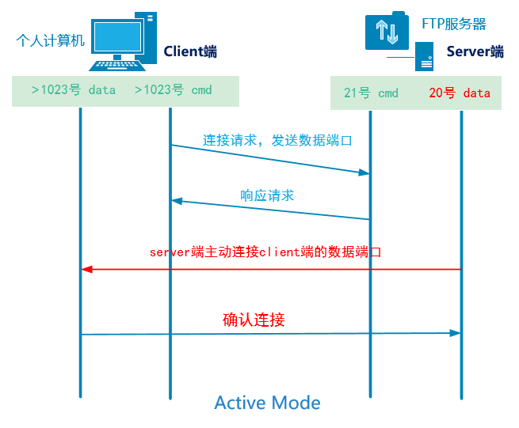

### 任务背景

某创业公司刚刚起步，随着业务量的增多，咨询和投诉的用户也越来越多，公司的客服部门由原来的2个增加到5个。客服部门平时需要处理大量的用户反馈，不管是邮件，还是ＱＱ，还是电话，客服人员都会针对每一次的用户反馈做==详细的记录== ，但是**由于客观原因**，客服人员没有成熟稳定的**客户服务系统**，所以希望运维部门能够协助搭建一个==文件共享服务==来管理这些文档，并且随时跟踪客户的反馈情况。

### 任务要求

1. 客服人员必须使用==用户名密码==(kefu/123)的方式登录服务器来下载相应文档
2. ==不允许匿名==用户访问
3. 客服部门的相关文档保存在==指定的目录==里/data/kefu    local_root=/data/kefu
4. 客服用户使用用户kefu/123登录后就==只能==在默认的==/data/kefu目录里活动==

### 任务拆解

1. 搭建ftp服务（新知识点）
2. 根据需求修改配置文件
   - 不允许匿名用户访问
   - 指定kefu人员数据目录，并且只能在指定目录活动

### 涉及知识点

- FTP服务的搭建（掌握）
- FTP服务的基本配置（==**重点**==）

### 课程目标

- 了解FTP服务的工作模式
- ==能够禁止FTP服务匿名用户登录==
- ==能够禁锢FTP服务本地用户的家目录==
- ==能够指定FTP服务本地用户和匿名用户的默认数据目录==

### 理论储备

#### 一、FTP服务介绍

**FTP（File Transfer Protocol）是一种应用非常广泛并且古老的一个互联网文件传输协议。**

 

- 主要用于互联网中==文件的双向传输==（上传/下载）、文件共享
- 跨平台   Linux、Windows
- FTP是==C/S==架构，拥有一个客户端和服务端，使用==TCP协议==作为底层传输协议，提供可靠的数据传输
- FTP的默认端口 ==21号==（命令端口）    ==20号==（数据端口，主动模式下） **默认被动模式**下
- FTP程序（软件）**==vsftpd==**

#### 二、FTP服务的客户端工具

- Linux：ftp、lftp（客户端程序）
- Windows：FileZilla、IE、Chrome、Firefox
- lftp和ftp工具区别：
  - lftp：默认是以==匿名用户==访问
  - ftp：默认是以==用户名/密码==方式访问
  - lftp可以批量并且下载目录

#### 三、FTP的两种工作模式

- 主动模式

 

1. 客户端打开大于1023的随机**命令端口**和大于1023的随机**数据端口**向服务的的21号端口发起请求
2. ==服务端==的21号命令端口响应客户端的随机命令端口
3. ==服务端==的20号端口==主动==请求连接客户端的随机数据端口
4. 客户端的随机数据端口进行确认

- 被动模式

 

1. 客户端打开大于1023的随机命令端口和大于1023的随机数据端口向服务的的21号端口发起请求
2. 服务端的21号命令端口响应客户端的随机命令端口
3. ==客户端主动==连接服务端打开的大于1023的随机数据端口
4. 服务端进行确认

**思考1：**

FTP的主动模式好还是被动模式好？


####  四、搭建简单FTP服务

1. 关闭防火墙和selinux
2. 配置yum源
3. 软件三部曲
4. 了解配置文件
5. 根据需求修改配置文件来完成服务的搭建
6. 启动服务，开机自启动
7. 测试验证

~~~powershell
[root@server ~]# rpm -ql vsftpd
/etc/rc.d/init.d/vsftpd			启动脚本
/etc/vsftpd							配置文件的目录
/etc/vsftpd/ftpusers				用户列表文件，黑名单
/etc/vsftpd/user_list			用户列表文件，可黑可白（默认是黑名单）
/etc/vsftpd/vsftpd.conf			配置文件
/usr/sbin/vsftpd					程序本身（二进制的命令）
/var/ftp								匿名用户的默认数据根目录
/var/ftp/pub						匿名用户的扩展数据目录
~~~

**了解配置文件:**  man 5 vsftpd.conf

~~~powershell
[root@ftp-server ~]# grep -v ^# /etc/vsftpd/vsftpd.conf 
anonymous_enable=YES			支持匿名用户访问	
local_enable=YES				非匿名用户
write_enable=YES				写总开关(主要针对非匿名用户)
local_umask=022					反掩码  file:644  rw- r-- r-- dir:755
dirmessage_enable=YES			启用消息功能
xferlog_enable=YES				开启或启用xferlog日志
connect_from_port_20=YES		支持主动模式（默认被动模式）
xferlog_std_format=YES			xferlog日志格式
listen=YES					    ftp服务独立模式下的监听

pam_service_name=vsftpd			指定认证文件
userlist_enable=YES				启用用户列表(user_list黑名单)
tcp_wrappers=YES				支持tcp_wrappers功能(限流)
~~~

### 任务解决方案

#### ㈠ 环境准备

```powershell
ftp-server:10.1.1.2		账号：kefu/123					 搭建FTP服务
client:10.1.1.1			Linux平台：ftp  lftp工具		测试验证
```

#### ㈡ 服务器端创建账号

```powershell
# useradd kefu
# echo 123|passwd --stdin kefu
```

#### ㈢ 服务器端搭建FTP服务

##### ① 安装软件

```powershell
# yum -y install vsftpd
# rpm -q vsftpd
vsftpd-2.2.2-24.el6.x86_64
```

##### ② 根据需求修改配置文件

```powershell
# vim /etc/vsftpd/vsftpd.conf
修改以下配置，没有需要自己增加：
anonymous_enable=NO		禁止匿名用户访问
local_root=/data/kefu	指定本地用户的默认数据根目录
chroot_local_user=YES	禁锢本地用户的默认数据目录
	

在ftp服务器上创建指定的数据目录
# mkdir /data/kefu -p
```

##### ③ 启动服务

```powershell
# service vsftpd restart
```

##### ④ 测试验证

Linux下测试：

```powershell
1）安装客户端工具
# yum -y install ftp lftp

2）客户端访问FTP服务
1.测试匿名用户是否可以访问
[root@MissHou ~]# lftp 10.1.1.2
lftp 10.1.1.2:~> ls
`ls' at 0 [Sending commands...]
或者
[root@MissHou ~]# ftp 10.1.1.2
Connected to 10.1.1.2 (10.1.1.2).
220 (vsFTPd 2.2.2)
Name (10.1.1.2:root): ftp				ftp代表匿名用户
331 Please specify the password.
Password:不输密码直接回车
530 Login incorrect.
Login failed.

注意：以上说明已经禁止匿名用户访问

2.测试客服用户(kefu/123)是否可以登录上传下载文件
[root@MissHou ~]# ftp 10.1.1.2
Connected to 10.1.1.2 (10.1.1.2).
220 (vsFTPd 2.2.2)
Name (10.1.1.2:root): kefu
331 Please specify the password.
Password:
230 Login successful.
Remote system type is UNIX.
Using binary mode to transfer files.
ftp> get test1				下载ftp服务器上的test1文件
local: test1 remote: test1
227 Entering Passive Mode (10,1,1,2,142,96).
150 Opening BINARY mode data connection for test1 (12 bytes).
226 Transfer complete.
12 bytes received in 7e-05 secs (171.43 Kbytes/sec)


ftp> put java_rsync.sh		上传客户端文件到ftp服务器
local: java_rsync.sh remote: java_rsync.sh
227 Entering Passive Mode (10,1,1,2,94,41).
553 Could not create file.
原因分析：
要么是ftp服务器端不允许本地用户上传，要么是上传文件的目录对kefu用户没有写权限
排查文件：
查看配置文件，write_enable=YES说明ftp是允许本地用户写的。
查看目录权限，发现该目录没有权限让kefu写
[root@server kefu]# ll -d /data/kefu/
drwxr-xr-x 2 root root 4096 Apr  1 09:30 /data/kefu/
解决问题：
[root@server kefu]# setfacl -m u:kefu:rwx /data/kefu/

再次测试成功：
ftp> put java_rsync.sh
local: java_rsync.sh remote: java_rsync.sh
227 Entering Passive Mode (10,1,1,2,37,110).
150 Ok to send data.
226 Transfer complete.
55 bytes sent in 0.069 secs (0.80 Kbytes/sec)

3. 测试kefu账号不能来回跳转
ftp> pwd
257 "/"
ftp> cd /etc
550 Failed to change directory.
```

**补充：**==关于禁锢用户的家目录选项==

```powershell
1. 禁锢所有人的家
chroot_local_user=YES
2. 禁锢大部分人，允许小部分人
chroot_local_user=YES
chroot_list_enable=YES		开启用户列表文件
chroot_list_file=/etc/vsftpd/chroot_list	指定用户列表文件

echo stu1 >> /etc/vsftpd/chroot_list

3. 允许大部分人，禁锢小部分人
chroot_local_user=NO
chroot_list_enable=YES		开启用户列表文件
chroot_list_file=/etc/vsftpd/chroot_list	指定用户列表文件

echo kefu >> /etc/vsftpd/chroot_list
```

### 任务总结

FTP文件共享服务的搭建
1. 明白需求——>学会拆解任务——>服务器+客户端
2. 实施落地——>做简单——>排错和分析定位问题（重要|掌握方法）——>情绪控制
3. 测试验证——>完成任务——>总结经验

#### Linux下客户端工具使用

##### FTP工具

~~~powershell
# ftp ftp服务器的IP地址
ftp> ?

lcd
get  mget
put  mput
!shell-commands
~~~

##### LFTP工具

~~~powershell
lftp localhost:~> mirror remote local  下载整个目录到本地
lftp localhost:~> mirror -R local remote  rename 上传整个目录到远程同时可以重命名
~~~

###补充扩展

#### FTP服务的访问控制

##### 1. 对象访问控制

ftpusers		黑名单	

user_list		默认是黑名单（可以成为白名单）

~~~powershell
[root@client ~]# ftp 10.1.1.1
Connected to 10.1.1.1 (10.1.1.1).
220 (vsFTPd 2.2.2)
Name (10.1.1.1:root): root
530 Permission denied.
Login failed.
ftp> exit
原因：root用户在黑名单里.ftpusers

[root@client ~]# ftp 10.1.1.1
Connected to 10.1.1.1 (10.1.1.1).
220 (vsFTPd 2.2.2)
Name (10.1.1.1:root): stu1
331 Please specify the password.
Password:
530 Login incorrect.
Login failed.
ftp> 

原因：stu1用户在黑名单里。ftpusers

为什么两个用户的提示信息不一样？
原因：默认情况下user_list文件也是黑名单，如果在该文件里直接拒绝，不给输入密码的机会。

user_list要成为白名单，需要再配置文件里增加：
userlist_deny=NO
注意：如果user_list是白名单，那么必须在该文件里的用户才可以访问ftp服务。
~~~

**总结：**

1. 用户在ftpusers文件中，那么用户不能访问ftp服务器
2. 用户在user_list文件中，如果该文件是白名单，那么==**只**==在该文件中的用户可以访问ftp服务
3. 如果user_list文件是白名单，用户即在ftpusers中又在user_list中，那么ftpusers拒绝优先

##### 2. 网络访问控制

- 支持tcp_wrappers

  /etc/hosts.allow 		允许

  /etc/hosts.deny		  拒绝

    

- 写法

~~~powershell
/etc/hosts.deny
服务程序:主机
vsftpd:all                        全部拒绝
vsftpd:all  EXCEPT 192.168.0.2    拒绝所有除了192.168.0.2  
vsftpd:192.168.0.254					 拒绝单个IP地址

vsftpd:192.168.0.254:allow  
//以上是允许192.168.0.254访问，类似/etc/hosts.allow里增加vsftpd:192.168.0.254

vsftpd:192.168.0.0/255.255.255.0   拒绝某个网段
vsftpd:192.168.0.0/255.255.255.0 EXCEPT 192.168.0.254   拒绝某个网段，但是除了某个ip地址
注意：子网掩码不支持192.168.0.0/24这种写法

vim /etc/hosts.deny
vsftpd,sshd:10.1.1.1
~~~

**思考2：** 如何判断一个服务是否支持tcp_wrappers？

1）./configure --enable-libwrap  表示支持tcp_wrappers访问控制

2）rpm安装

~~~powershell
# ldd /usr/sbin/vsftpd |grep libwrap*
	libwrap.so.0 => /lib64/libwrap.so.0 (0x00007f2956480000)

# ldd /usr/sbin/sshd |grep libwrap*
	libwrap.so.0 => /lib64/libwrap.so.0 (0x00007f015ff29000)

~~~

示例：拒绝10.1.1.0/24和192.168.91.0/24网段的所有人访问，除了10.1.1.3服务器

~~~powershell
vim /etc/hosts.deny
vsftpd:10.1.1.0/255.255.255.0,192.168.91.0/255.255.255.0 EXCEPT 10.1.1.3
~~~

### 课后实战

- 准备环境：

  主机1（server）：FTP服务器    10.1.1.1
  主机2（client）：FTP客户端      10.1.1.2

- 根据需求搭建自己的FTP服务器：

1. ==匿名用户==可以到==/anon/data目录==里==上传下载==文件，同时也可以下载其他人所上传的文件;

2. 客户端可以使用zhangsan（自己名字），访问你的ftp服务器，但是不能登录ftp服务器的操作系统，并且只能在自己的家目录中活动;

3. zhangsan（自己名字）用户可以上传下载文件，并且所有本地用户上传的文件都存放在/local/data;

4. 在客户端/tmp/zhangsan（自己名字）下面创建5个文件，叫file{1..5},通过客户端工具以匿名用户身份将/tmp/zhangsan整个以你名字命名的目录上传到FTP服务器的pub目录中;

5. 客户端通过redhat用户（密码redhat）下载FTP服务器上的"2018-11-10"文件(自己创建)到你本地/tmp/zhangsan(自己名字)目录里;

6. 不允许192.168.0.254访问你的ftp服务。

7. 固定服务器端被动模式下的端口号范围为2000~2050

8. 限制匿名用户下载文件的速率为500kbps，最大连接数为10个


