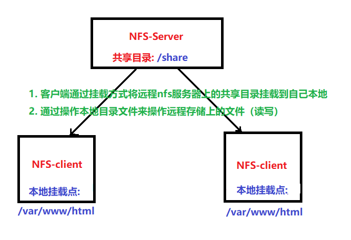
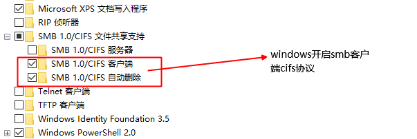

### 任务背景

由于业务驱动，为了提高用户的访问效率，现需要将原有web服务器上的静态资源文件分离出来，单独保存到一台文件服务器上。


### 任务要求

1. 一台应用服务器web-server部署apache，静态网页资源存放在另外一台NFS服务器上
2. 对于NFS服务器上保存的静态资源实行实时备份（inotify + rsync）

### 任务拆解

1. 共享存储服务器搭建NFS服务，为web服务器提供静态资源文件内容
   - 创建共享目录来保存静态资源文件
   - 发布该共享目录给web服务使用
2. 一台服务器搭建web服务，并==使用==（**挂载**）共享存储的静态资源



### 涉及知识点

- ==NFS服务的搭建(新知识点)==
- mount命令挂载网络资源（掌握）
- rsync工具实现对共享存储上的静态资源备份（旧知识点）

### 课程目标

- 了解NFS服务的应用场景及特点
- ==能够通过NFS服务实现文件共享（重点）==
- 能够使用mount命令==**挂载**==网络共享资源

### 理论储备

#### 一、NFS服务介绍

**NFS（Network File System）网络文件系统**

- 主要用于**linux系统**上实现文件共享的一种协议，其客户端**主要是Linux**
- **没有用户认证机制**，且数据在网络上传送的时候是**明文传送**，一般只能在**局域网**中使用
- 支持多节点同时挂载及并发写入

**企业应用：为集群中的web server提供后端存储**

**该服务包括的组件：**

RPC（Remote Procedure Call Protocol）：
远程过程调用协议，它是一种通过网络从远程计算机程序上请求服务，不需要了解底层网络技术的协议。

**rpcbind**	                 //负责NFS的数据传输，远程过程调用  ==tcp/udp协议 端口111==

**nfs-utils**	        //控制共享哪些文件,权限管理


#### 二、NFS服务相关软件包

```powershell
nfs-utils-1.2.3-26.el6.x86_64 		nfs服务的一个脚本控制工具（服务端与客户端）
nfs4-acl-tools-0.3.3-6.el6.x86_64	acl 工具包
nfs-utils-lib-1.1.5-4.el6.x86_64  	nfs 库文件

[root@nfs-server ~]# rpm -q rpcbind
rpcbind-0.2.0-11.el6.x86_64
[root@nfs-server ~]# rpm -aq|grep ^nfs
nfs-utils-1.2.3-39.el6.x86_64
nfs-utils-lib-1.1.5-6.el6.x86_64
nfs4-acl-tools-0.3.3-6.el6.x86_64
```

#### 三、配置文件解读

```powershell
/etc/exports  man 5 exports

共享目录        共享选项
/nfs/share      *(ro,sync)

共享主机：
*   ：代表所有主机
192.168.0.0/24：代表共享给某个网段
192.168.0.0/24(rw) 192.168.1.0/24(ro) :代表共享给不同网段
192.168.0.254：共享给某个IP
*.itcast.com:代表共享给某个域下的所有主机

共享选项：
ro：只读
rw：读写
sync：实时同步，直接写入磁盘
async：异步，先缓存在内存再同步磁盘
anonuid：设置访问nfs服务的用户的uid，uid需要在/etc/passwd中存在
anongid：设置访问nfs服务的用户的gid
root_squash ：默认选项 root用户创建的文件的属主和属组都变成nfsnobody,其他人nfs-server端是它自己，client端是nobody。
no_root_squash：root用户创建的文件属主和属组还是root，其他人server端是它自己uid，client端是nobody。
all_squash： 不管是root还是其他普通用户创建的文件的属主和属组都是nfsnobody

说明：
anonuid和anongid参数和all_squash一起使用。
all_squash表示不管是root还是其他普通用户从客户端所创建的文件在服务器端的拥有者和所属组都是nfsnobody；服务端为了对文件做相应管理，可以设置anonuid和anongid进而指定文件的拥有者和所属组

```

### 任务解决方案

~~~powershell
环境准备：
Web-server：10.1.1.11
NFS-server：10.1.1.12
详细步骤：
1. 搭建NFS-server
	1）创建共享目录及网站的静态资源文件
	mkdir /share
	echo "hello 来到我的世界" > /share/index.html
	2）发布共享目录
	[root@nfs-server ~]# cat /etc/exports 
	/share  10.1.1.0/24(ro)
	3）启动服务检查端口是否监听
[root@nfs-server ~]# service rpcbind start
Starting rpcbind:                                          [  OK  ]
[root@nfs-server ~]# service nfs start
Starting NFS services:                                     [  OK  ]
Starting NFS mountd:                                       [  OK  ]
Starting NFS daemon:                                       [  OK  ]
Starting RPC idmapd:                                       [  OK  ]
查看端口111是否监听：
[root@nfs-server ~]# netstat -nltpu|grep rpcbind
	
2. 搭建web服务
	1）安装软件
[root@web-server ~]# rpm -q httpd
httpd-2.2.15-29.el6.centos.x86_64
	2）挂载nfs-server端共享目录

[root@web-server ~]# mount -t nfs 10.1.1.12:/share /var/www/html/media      
mount: wrong fs type, bad option, bad superblock on 10.1.1.1:/share,
       missing codepage or helper program, or other error
       (for several filesystems (e.g. nfs, cifs) you might
       need a /sbin/mount.<type> helper program)
       In some cases useful info is found in syslog - try
       dmesg | tail  or so
  原因：客户端没有安装nfs相关的工具包
  解决：
[root@web-server ~]# yum -y install nfs-utils nfs-utils-lib nfs4-acl-tools
[root@web-server ~]# mount -t nfs 10.1.1.1:/share /var/www/html
或者
[root@web-server ~]# mount.nfs 10.1.1.1:/share /var/www/html/
[root@web-server ~]# df -h
Filesystem                     Size  Used Avail Use% Mounted on
/dev/mapper/vg_server-lv_root   18G  2.3G   15G  14% /
tmpfs                          491M     0  491M   0% /dev/shm
/dev/sda1                      485M   33M  427M   8% /boot
/dev/sr0                       4.2G  4.2G     0 100% /mnt
10.1.1.1:/share                 18G  3.1G   14G  19% /var/www/html
	3）在web-server端查看首页文件
[root@web-server ~]# ll /var/www/html/
total 4
-rw-r--r-- 1 root root 25 Dec 30 02:48 index.html
	4）启动Apache服务
[root@web-server ~]# service httpd start
3. 测试验证
Windows：
http://10.1.1.2
Linux：
# yum -y install elinks
# elinks http://10.1.1.2

客户端访问常见的问题：
[root@MissHou ~]# showmount -e 10.1.1.1
clnt_create: RPC: Port mapper failure - Unable to receive: errno 113 (No route to host)

原因：
1. nfs-server端rpcbind服务没开
2. 网络问题
3. 防火墙问题
==================================================================================
环境：
nfs-server：10.1.1.1
backup：10.1.1.250

4. 实现nfs-server端的数据文件实时同步
1）安装inotify工具
[root@nfs-server ~]# pwd
/soft
[root@nfs-server ~]# tar xf inotify-tools-3.13.tar.gz 
[root@nfs-server ~]# ls
inotify-tools-3.13  inotify-tools-3.13.tar.gz
[root@nfs-server ~]# cd inotify-tools-3.13
[root@nfs-server inotify-tools-3.13]# ls
aclocal.m4  config.guess  configure     depcomp     libinotifytools  Makefile.in  NEWS
AUTHORS     config.h.in   configure.ac  INSTALL     ltmain.sh        man          README
ChangeLog   config.sub    COPYING       install-sh  Makefile.am      missing      src
[root@nfs-server inotify-tools-3.13]# ./configure 
[root@nfs-server inotify-tools-3.13]# make
[root@nfs-server inotify-tools-3.13]# make install

2）编写脚本
[root@nfs-server ~]# vim rsync.sh
#!/bin/bash
/usr/local/bin/inotifywait -mrq -e modify,delete,create,attrib,move /share |while read events
        do
                rsync -a --delete /share 10.1.1.250:/backup/
                echo "`date +%F\ %T`出现事件$events" >> /var/log/rsync.log 2>&1
        done

加可执行权限：
[root@nfs-server ~]# chmod +x rsync.sh 

注意：在backup备份机器上创建/backup目录！！！
说明：解决不需要交互有两种方案，其一可以配置免密登录；其二可以在backup机搭建rsync服务
3) 配置nfs-server的root用户免密码登录backup机器
[root@nfs-server ~]# ls ~/.ssh/
known_hosts
[root@nfs-server ~]# ssh-keygen 
。。。
[root@nfs-server ~]# ls ~/.ssh/
id_rsa  id_rsa.pub  known_hosts
[root@nfs-server ~]# cd ~/.ssh/
[root@nfs-server .ssh]# ssh-copy-id -i id_rsa.pub root@10.1.1.250

4）脚本放到后台去运行
[root@nfs-server ~]# ./rsync.sh &

5）测试验证
nfs-server端改变文件：
[root@nfs-server ~]# cd /share/
[root@nfs-server share]# mkdir aaa
[root@nfs-server share]# touch test{1..3}

查看日志：
[root@nfs-server ~]# tail -f /var/log/rsync.log 
2018-12-30 07:31:36出现事件/share/ CREATE,ISDIR aaa
2018-12-30 07:32:15出现事件/share/ CREATE test1
2018-12-30 07:32:16出现事件/share/ ATTRIB test1
2018-12-30 07:32:16出现事件/share/ CREATE test2
2018-12-30 07:32:16出现事件/share/ ATTRIB test2
2018-12-30 07:32:16出现事件/share/ CREATE test3
2018-12-30 07:32:16出现事件/share/ ATTRIB test3

backup备份机查看数据同步情况：
[root@backup backup]# ll
total 8
drwxr-xr-x 2 root root 4096 Dec 30 07:31 aaa
-rw-r--r-- 1 root root   25 Dec 30 02:48 index.html
-rw-r--r-- 1 root root    0 Dec 30 07:32 test1
-rw-r--r-- 1 root root    0 Dec 30 07:32 test2
-rw-r--r-- 1 root root    0 Dec 30 07:32 test3
~~~

mount -t nfs   mount.nfs

mount -t cifs   mount.cifs

### 扩展：samba服务

#### 一、samba介绍

- SMB（Server Message Block）协议实现文件共享，也称为CIFS（Common Internet File System ）
- 是Windows和类Unix系统之间共享文件的一种协议
- 客户端==主要是Windows==；支持多节点同时挂载以及并发写入


- 主要用于windows和Linux下的文件共享、打印共享
- 实现==匿名与本地用户==文件共享

**Samba服务的主要进程：**

- smbd进程 	   控制发布共享目录与权限、==负责文件传输==   ==TCP  139 445==
- nmbd进程        用于名称解析netbios   ==UDP 137 138== ;基于NETBIOS协议获得计算机名称——>解析为相应IP地址，实现信息通讯 

 NetBIOS是Network Basic Input/Output System的简称，一般指用于局域网通信的一套API  

#### 二、samba服务器搭建

~~~powershell
[root@smb-server ~]# rpm -aq|grep ^samba
samba-3.6.9-164.el6.x86_64				服务端软件包
samba-common-3.6.9-164.el6.x86_64
samba-winbind-3.6.9-164.el6.x86_64
samba-client-3.6.9-164.el6.x86_64
samba-winbind-clients-3.6.9-164.el6.x86_64
samba4-libs-4.0.0-58.el6.rc4.x86_64

~~~

了解配置文件：

~~~powershell
/etc/samba/smb.conf
[global]  全局选项
	workgroup = MYGROUP                 定义samba服务器所在的工作组
	server string = Samba Server Version %v         smb服务的描述
	log file = /var/log/samba/log.%m            日志文件
	max log size = 50                   日志的最大大小KB  
	security = user             认证模式：share匿名|user用户密码|server外部服务器用户密码
	passdb backend = tdbsam         密码格式
	load printers = yes         加载打印机
	cups options = raw          打印机选项
[homes]                 局部选项（共享名称）
	comment = Home Directories      描述
	browseable = no      隐藏共享名称
	writable = yes      可读可写
[printers]      共享名称
	comment = All Printers       描述
	path = /var/spool/samba  本地的共享目录
	browseable = no  隐藏
	guest ok = no ——>   public = no  需要帐号和密码访问
	writable = no  ——>  read only =yes 不可写 
	printable = yes      打印选项
[share]
	path = /dir1
	guest ok = no
	writable = yes

~~~

**需求：**
搭建一个SAMBA服务，共享一个目录/samba/share,客户端使用user01/123通过windows或者Linux可以在该目录里创建文件删除文件

~~~powershell
smb-server:10.1.1.1
1. 关闭防火墙和selinux
2. 配置yum源
3. 软件三步曲
1）安装软件
[root@smb-server ~]# yum -y install samba
2）确认软件是否成功安装
[root@smb-server ~]# rpm -aq|grep  ^samba
samba-winbind-3.6.9-164.el6.x86_64
samba-winbind-clients-3.6.9-164.el6.x86_64
samba-3.6.9-164.el6.x86_64
samba-common-3.6.9-164.el6.x86_64
3）查看软件的文件列表
/etc/init.d/nmbd
/etc/init.d/smbd
/usr/sbin/nmbd
/usr/sbin/smbd

[root@smb-server ~]# rpm -ql samba-common
/etc/samba/smb.conf		配置文件

4. 根据需求通过修改配置文件完成服务的搭建
1）创建一个共享目录
mkdir /samba/share -p

2) 修改配置文件
vim /etc/samba/smb.conf
...
[smb_share]
        comment = samba service
        path = /samba/share
        guest ok = no
        writable = yes
或者
[samba_share]
        path = /samba/share
        public = no
        writable = yes
        
3) 创建一个本地用户并且加入到samba数据库里
[root@smb-server samba]# useradd user01
[root@smb-server samba]# id user01
uid=508(user01) gid=510(user01) groups=510(user01)
[root@smb-server samba]# which smbpasswd 
/usr/bin/smbpasswd
[root@smb-server samba]# rpm -qf /usr/bin/smbpasswd 
samba-common-3.6.23-51.el6.x86_64
[root@smb-server samba]# smbpasswd -a user01
New SMB password:
Retype new SMB password:
Added user user01.
[root@smb-server samba]# pdbedit -L
user01:508:

5. 启动服务
[root@smb-server samba]# /etc/init.d/nmb start
Starting NMB services:                                     [  OK  ]
[root@smb-server samba]# /etc/init.d/smb start
Starting SMB services:                                     [  OK  ]

6. 测试验证
windows：

Linux下：
查看samba服务共享资源：
[root@client ~]# smbclient -L 10.1.1.1 -U user01
Enter user01's password: 
session setup failed: SUCCESS - 0
解决：
服务端修改hosts文件将IP和主机名一 一对应起来

查看smb服务端共享的模块或者标签：
[root@client ~]# smbclient -L 10.1.1.1 -U user01
Enter user01's password: 
-L: 列出
-U:指定用户查看

直接访问smb服务：
[root@client ~]# smbclient //10.1.1.1/smb_share -U user01
Enter user01's password: 
Domain=[MYGROUP] OS=[Unix] Server=[Samba 3.6.23-51.el6]
smb: \> ls
  .                                   D        0  Sat Sep  1 10:10:00 2018
  ..                                  D        0  Sat Sep  1 10:10:00 2018

		35418 blocks of size 524288. 29675 blocks available

问题可以查看共享的文件，但是不能够创建文件
分析：
服务开放了写权限，但是目录本身没有对user01用户开发写权限
解决：
[root@smb-server samba]# setfacl -m u:user01:rwx /samba/share/
-m：修改权限
u:表示用户
g:表示组

[root@smb-server samba]# setfacl -m g:admin:rx /samba/share

挂载使用：
[root@client ~]# mount.cifs -o user=user01,pass=123 //10.1.1.1/samba/share /u01

没有mount.cifs命令，请安装cifs-utils-4.8.1-19.el6.x86_64
~~~

windows下如果无法访问，请查看是否开启了smb客户端程序：



访问控制：

~~~powershell
控制读写权限
	writable = yes/no
	readonly = yes/no

如果资源可写，但只允许某些用户可写，其他都是只读
write list = admin, root, @staff（用户组）
read list = mary, @students

控制访问对象
	valid users = tom,mary,@itcast
	invalid users = tom
注意：以上两个选项只能存在其中一个

网络访问控制：
hosts deny = 192.168.0.   拒绝某个网段
hosts allow = 192.168.0.254  允许某个IP
hosts deny = all  拒绝所有
hosts allow = 192.168.0. EXCEPT 192.168.0.254  允许某个网段，但拒绝某个单个IP
注意：deny和allow同时存在，allow优先
~~~

#### 三、总结

1. ftp 局域网和外网都可以
2. nfs  局域网   挂载方式访问  mount.nfs
3. samba 局域网  直接访问（smbclinet）  挂载的方式mount.cifs


