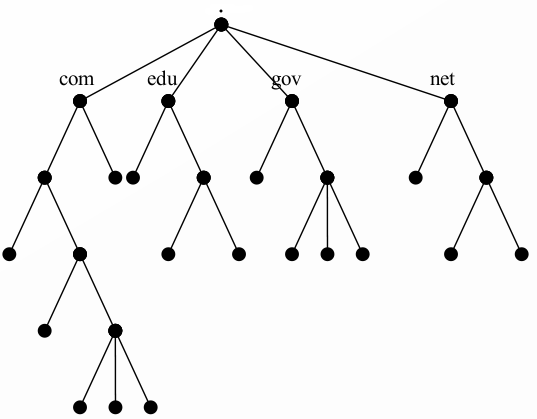
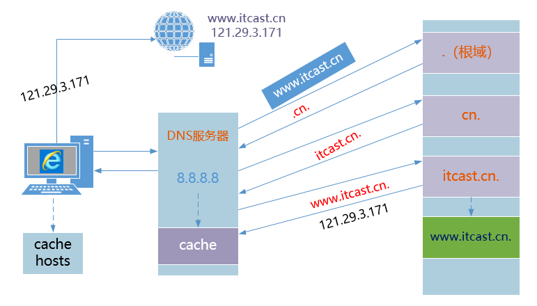

# 一、场景引入

## 1、任务背景

公司内网中需要通过域名访问到开发的web应用。获得更好的访问体验。故需要在内网中搭建DNS服务器解析域名，开发、测试、运维人员。可以通过内网DNS服务，访问到公司内部应用。

## 2、任务要求

1. 解析内网域名，能够访问内网web应用

   www.itcast.cluster    解析到服务器IP

## 3、任务拆解

1. 搭建DNS服务
2. 客户端配置DNS服务地址

## 4、课程目标

- DNS服务的作用
- 域名的构成
- ==DNS服务搭建（掌握）==
- ==解析域名操作 （掌握）==

# 二、理论储备

## 1、DNS介绍

**DNS（domain name system ） 域名管理系统**

- 域名：

由特定的格式组成，用来表示互联网中==某一台计算机或者计算机组的名称==，能够使人更方便的访问互联网，而不用记住能够被机器直接读取的IP地址。

### 1、DNS的作用

- 域名的==正向解析==

  将主机域名转换为对应的IP 地址，以便网络程序能够通过主机域名访问到对应的服务器主机

  **域名——>IP**		A记录

- 域名的==反向解析==

  将主机的IP地址转换为对应的域名，以便网络（服务）程序能够通过IP地址查询到主机的域名

  **IP——>域名**		PTR记录

### 2、DNS的结构



**根域 .**

- 在整个 DNS 系统的最上方一定是 . (小数点) 这个 DNS 服务器 (称为 root)，也叫”根域“。
- 根域 （13台 全世界只有13台。1个为主根服务器，放置在美国。其余12个均为辅根服务器，其中9个放置在美国，欧洲2个，位于英国和瑞典，亚洲1个，位于日本。）

**一级域名<顶级域|国家域>**

com edu gov org cc  io| cn uk us ru ja ko 

**二级域名**

qq.com**.**   baidu.com.  google.com. 

**域名机构**

收费（新网|万网）
老牌免费域名：TK顶级域名、TK域名DNS、TK域名商

### 3、DNS工作原理



如果询问一次得到结果  递归查询    C-S
如果询问多次得到结果  迭代查询    S-S 

**一次递归 多次迭代 **

~~~powershell
dig +trace www.baidu.com  	  追踪dns解析过程
dig @server www.baidu.com  	  正向解析查询
dig -x 192.168.0.1 @server    反向解析查询
dig +trace www.baidu.com  	  追踪一个域名解析过程
~~~

### 4、DNS服务端软件

- DNS 的==域名解析==都是 **==udp/53==** . 主从之间的==数据传输==默认使用**==tcp/53==**

- DNS软件：

  ==Bind==是一款开放源码的DNS服务器软件，Bind由美国加州大学Berkeley（伯克利）分校开发和维护的，全名为Berkeley Internet Name Domain它是目前世界上使用最为广泛的DNS服务器软件，支持各种unix平台和windows平台。BIND现在由互联网系统协会（Internet Systems Consortium）负责开发与维护。

## 2、DNS基本部署使用

**需求：**当客户端访问`http://www.itcast.cluster`时可以看到web服务的首页

| IP             | hostname   | type                      |
| -------------- | ---------- | ------------------------- |
| 192.168.19.100 | dns-server | DNS服务  域名解析使用     |
| 192.168.19.101 | web-server | web服务   提供web业务访问 |
| 192.168.19.104 | client     | 测试访问web服务           |

根据以上要求，准备机器，并设置主机名

### 1、DNS服务搭建

####  （一）基础环境准备

##### ①关闭防火墙和selinux

##### ②配置yum源

#### （二）DNS服务安装

==在dns-server操作==

##### ①安装bind

```powershell
yum -y install bind
```

##### ②查看软件

```powershell
rpm -q bind
# 查询结果
bind-9.11.4-9.P2.el7.x86_64

rpm -ql bind

# 日志轮转文件
/etc/logrotate.d/named
# 配置文件目录
/etc/named
# 主配置文件
/etc/named.conf
# zone文件,定义域
/etc/named.rfc1912.zones
# 服务管理脚本
/usr/lib/systemd/system/named.service
# 二进制程序文件
/usr/sbin/named
# 检测配置文件
/usr/sbin/named-checkconf
# 检测域文件
/usr/sbin/named-checkzone
# 根域服务器
/var/named/named.ca
# 正向解析区域文件模板
/var/named/named.localhost
# 反向解析区域文件模板
/var/named/named.loopback
# dns服务器下载文件的默认路径
/var/named/slaves
# 进程pid
/var/rum/named
```

### 2、正向解析的使用

#### （一）配置使用

##### ①备份原配置文件

```powershell
cp /etc/named.conf /etc/named.conf.bak
cp /etc/named.rfc1912.zones /etc/named.rfc1912.zones.bak
```

##### ②修改主配置文件

```powershell
# 修改文件的第11行、21行
# 注意以下注释的两处
vim /etc/named.conf

# 定义监听端口、监听方式、允许查询来源
options {
        // 定义监听方式  any代表全网监听
        listen-on port 53 { 127.0.0.1;any; };
        listen-on-v6 port 53 { ::1; };
        directory       "/var/named";
        dump-file       "/var/named/data/cache_dump.db";
        statistics-file "/var/named/data/named_stats.txt";
        memstatistics-file "/var/named/data/named_mem_stats.txt";
        recursing-file  "/var/named/data/named.recursing";
        secroots-file   "/var/named/data/named.secroots";
        // 允许任何人来查询
        allow-query     { localhost;any; };

        /*
         - If you are building an AUTHORITATIVE DNS server, do NOT enable recursion.
         - If you are building a RECURSIVE (caching) DNS server, you need to enable
           recursion.
         - If your recursive DNS server has a public IP address, you MUST enable access
           control to limit queries to your legitimate users. Failing to do so will
           cause your server to become part of large scale DNS amplification
           attacks. Implementing BCP38 within your network would greatly
           reduce such attack surface
        */
        recursion yes;

        dnssec-enable yes;
        dnssec-validation yes;

        /* Path to ISC DLV key */
        bindkeys-file "/etc/named.root.key";

        managed-keys-directory "/var/named/dynamic";

        pid-file "/run/named/named.pid";
        session-keyfile "/run/named/session.key";
};
```

##### ③修改子配置文件

```powershell
# 定义DNS服务器管理哪些域

vim /etc/named.rfc1912.zones

# 在该配置文件后追加以下内容

# 正向
zone "itcast.cluster" IN {
        type master;
        file "itcast.cluster.zone";
        allow-update { none; };
};
```

##### ④复制创建zone文件

```powershell
cd /var/named/
cp -p named.localhost lamp.cluster.zone
cp -p name.loopback 192.168.19.zone
```

#####  ⑤修改区域文件

模板基本格式不要变动，修改需要的就可以

```powershell
vim lamp.cluster.zone

# 修改为以下内容

$TTL 1D
@       IN SOA  @ rname.invalid. (
                                        0       ; serial
                                        1D      ; refresh
                                        1H      ; retry
                                        1W      ; expire
                                        3H )    ; minimum
        NS      @
        A       127.0.0.1
        AAAA    ::1
# 这里添加一条解析记录
www     A       192.168.19.101
```

##### ⑥ 检测配置文件

```powershell
named-checkconf /etc/named.conf
named-checkconf /etc/named.rfc1912.zones

cd /var/named
named-checkzone web.cluster.zone web.cluster.zone
```

##### ⑦启动服务并检测服务状态

```powershell
systemctl start named

systemctl status named

# 查看端口53 953 rndc
netstat -lntp|grep named
```

#### （二）客户端配置dns服务地址

==在client端操作==

##### ①配置指向dns服务地址

```power
echo nameserver 192.168.19.100 > /etc/resolv.conf
```

##### ②检测解析

```powershell
nslookup www.lamp.cluster

# 查看结果
Server:         192.168.19.100
Address:        192.168.19.100#53

Name:   www.lamp.cluster
Address: 192.168.19.101

host www.lamp.cluster
```

### 3、反向解析使用

#### （一）修改相关配置

##### ①修改子配置文件

```powershell
vim /etc/named.rfc1912.zones

# 在该配置文件后追加以下内容

# 反向
zone "19.168.192.in-addr.arpa" IN {
        type master;
        file "192.168.19.zone";
        allow-update { none; };
};
```

#####  ②修改区域文件

模板基本格式不要变动，修改需要的就可以

```powershell
vim 192.168.19.zone

# 修改为以下内容

$TTL 1D
@       IN SOA  @ rname.invalid. (
                                        0       ; serial
                                        1D      ; refresh
                                        1H      ; retry
                                        1W      ; expire
                                        3H )    ; minimum
        NS      @
        A       127.0.0.1
        AAAA    ::1
        PTR     localhost.
# 反向解析 记录PTR
101     PTR     www.lamp.cluster
```

##### ③ 检测配置文件

```powershell
named-checkconf /etc/named.conf
named-checkconf /etc/named.rfc1912.zones

cd /var/named
named-checkzone 192.168.19.zone 192.168.19.zone
```

##### ④启动服务并检测服务状态

#### （二）客户端配置dns服务地址

##### ①配置指向dns服务地址

##### ②检测反向解析

```powershell
nslookup 192.168.19.101

host 192.168.19.101
```

### 4、配置文件相关参数说明

#### （一）主配置文件

~~~powershell
vim /etc/named.conf

options {
        # 监听方式 any表示全网监听
        listen-on port 53 { 127.0.0.1;any; };
        listen-on-v6 port 53 { ::1; };
        directory       "/var/named";
        # DNS缓存
        dump-file       "/var/named/data/cache_dump.db";
        # 统计
        statistics-file "/var/named/data/named_stats.txt";
        # 内存统计
        memstatistics-file "/var/named/data/named_mem_stats.txt";
        recursing-file  "/var/named/data/named.recursing";
        secroots-file   "/var/named/data/named.secroots";
         # 允许哪些人可以查询；any代表任何人
        allow-query     { localhost;any; };

        /*
         - If you are building an AUTHORITATIVE DNS server, do NOT enable recursion.
         - If you are building a RECURSIVE (caching) DNS server, you need to enable
           recursion.
         - If your recursive DNS server has a public IP address, you MUST enable access
           control to limit queries to your legitimate users. Failing to do so will
           cause your server to become part of large scale DNS amplification
           attacks. Implementing BCP38 within your network would greatly
           reduce such attack surface
        */
        # 是否递归 
        recursion yes;
        # dns安全扩展机制（签名认证）
        dnssec-enable yes;
        dnssec-validation yes;

        /* Path to ISC DLV key */
        bindkeys-file "/etc/named.root.key";

        managed-keys-directory "/var/named/dynamic";

        pid-file "/run/named/named.pid";
        session-keyfile "/run/named/session.key";
};
# 说明
# DNSSEC 域名系统安全，他是DNS的安全扩展协议
# DLV DNSSEC 后备密钥
# 这些安全机制的设定，是为了保护DNS服务器与用户之间的数据安全，避免恶意数据对用户的欺骗

# 日志记录
logging {
        channel default_debug {
                file "data/named.run";
                severity dynamic;
        };
};
# 根域服务器
zone "." IN {
        type hint;
        file "named.ca";
};

include "/etc/named.rfc1912.zones";
include "/etc/named.root.key";
~~~

#### （二）子配置文件和区域文件

##### ①子配置文件

```powershell
vim /etc/named.rfc1912.zones
# 定义正向域的模板
zone "localhost.localdomain" IN {
	type master;
	file "named.localhost";
	allow-update { none; };
};

# 定义反向的模板
zone "1.0.0.127.in-addr.arpa" IN {
	type master;
	file "named.loopback";
	allow-update { none; };
};
```

##### ②域文件

~~~powershell
cat /var/named/named.localhost

# 文件内容
$TTL 1D
@       IN SOA  @ rname.invalid. (
                                        0       ; serial
                                        1D      ; refresh
                                        1H      ; retry
                                        1W      ; expire
                                        3H )    ; minimum
        NS      @
        A       127.0.0.1
        AAAA    ::1

# $TTL  缓存的生存周期
# @ = zonename = itcast.com  当前域
# IN  互联网
# SOA 开始授权
# NS  dns服务端	nameserver
# A   ipv4 正向
# AAAA IPV6
# CNAME 别名
# MX  邮件交互记录  5 数字代表优先级 数字越小优先级越高

# 0       ; serial    更新序列号	
# 1D      ; refresh   更新间隔（从服务器下载数据）
# 1H      ; retry     失败重试
# 1W      ; expire    区域文件的过期时间
# 3H )    ; minimum   缓存的最小生存周期

# D Day、H Hour、W Week
~~~

# 课程目标

> - [ ] 了解DNS服务的作用
> - [ ] 理解DNS服务的工作原理
> - [ ] 掌握DNS服务的正向解析配置(重点)
> - [ ] 能够搭建DNS的主从服务（了解）

# 课程扩展

## 1、多域搭建

- **需求**

搭建一个DNS服务器，可以同时解析test.net和heima.cc域

| 域名         | IP             |
| ------------ | -------------- |
| www.test.net | 192.168.19.101 |
| bbs.heima.cc | 192.168.19.101 |

### 1、DNS服务端操作

#### （一）配置文件修改

##### ①修改子配置文件

```powershell
# 定义DNS服务器管理哪些域

vim /etc/named.rfc1912.zones

# 在该配置文件后追加以下内容

# 正向
zone "test.net" IN {
        type master;
        file "test.net.zone";
        allow-update { none; };
};

zone "heima.cc" IN {
        type master;
        file "heima.cc.zone";
        allow-update { none; };
};
```

##### ②复制创建zone文件

```powershell
cd /var/named/
cp -p named.localhost test.net.zone
cp -p named.localhost test.net.zone
```

#####  ③修改区域文件

修改test.net域文件

```powershell
vim test.net.zone

# 修改为以下内容

$TTL 1D
@       IN SOA  @ rname.invalid. (
                                        0       ; serial
                                        1D      ; refresh
                                        1H      ; retry
                                        1W      ; expire
                                        3H )    ; minimum
        NS      @
        A       127.0.0.1
        AAAA    ::1
# 这里添加一条解析记录
www     A       192.168.19.101
```
修改heima.cc域文件

```powershell
vim heima.cc.zone

# 修改为以下内容

$TTL 1D
@       IN SOA  @ rname.invalid. (
                                        0       ; serial
                                        1D      ; refresh
                                        1H      ; retry
                                        1W      ; expire
                                        3H )    ; minimum
        NS      @
        A       127.0.0.1
        AAAA    ::1
# 这里添加一条解析记录
bbs     A       192.168.19.101
```

#### （二）配置语法检测并启动服务

##### ④检测配置文件

```powershell
named-checkconf /etc/named.conf
named-checkconf /etc/named.rfc1912.zones

cd /var/named
named-checkzone test.net.zone test.net.zone
named-checkzone heima.cc.zone heima.cc.zone
```

##### ⑤启动服务并检测服务状态

### 2、客户端操作

#### （三）客户端测试解析

##### ⑥客户单配置dns服务定义并测试

```powershell
# 修改dns服务地址
echo nameserver 192.168.19.100 > /etc/resolv.conf

# 检测解析
nslookup www.test.net

# 查看结果
Server:         192.168.19.100
Address:        192.168.19.100#53

Name:   www.test.net
Address: 192.168.19.101

host www.test.net


# 检测解析
nslookup bbs.heima.cc

# 查看结果
Server:         192.168.19.100
Address:        192.168.19.100#53

Name:   bbs.heima.cc
Address: 192.168.19.101

host bbs.heima.cc
```

## 2、主从DNS搭建

- **环境准备**

| IP             | 主机名称   | 作用                           |
| -------------- | ---------- | ------------------------------ |
| 192.168.19.100 | dns-master | dns主服务器、ntp时间同步服务器 |
| 192.168.19.101 | dns-server | dns从服务器                    |
| 192.168.19.102 | client     | 测试客户端                     |

### 1、时间同步服务

#### （一）ntpd服务同步

http://www.ntp.org.cn/pool.php

```powershell
# ntpdate ntp-server
ntpdate cn.ntp.org.cn
```

#### （二）xinetd和rdate方式同步

##### ①安装xinetd软件

```powershell
yum -y install xinetd
```

##### ②修改配置文件

~~~powershell
vim /etc/xinetd.d/time-stream 
# 修改内容
disable = no

vim /etc/xinetd.d/time-dgram
# 修改内容
disable = no

~~~

##### ③启动服务

```powershell
# 启动xinetd
systemctl restart xinetd 

# 查看服务状态   37端口
netstat -nltup|grep xinetd
```

##### ④客户端同步时间

```powershell
 rdate -s ntp-server
```

**总结：**

- ntpd时间同步服务依赖外网，客户端同步时需要时间稍长

- xinetd管理的时间同步服务，一般用于局域网中的时间同步


### 2、DNS主从部署

> - **基础要求说明 ** 一般常见主从架构服务的要求
>
> 1. master和slave的==系统时间==保持一致
> 2. slave服务器上安装相应的软件（系统版本、软件版本保持一致）
> 3. 根据需求修改相应的配置文件（master和slave都应该去修改）
> 4. 主从同步的核心是**==slave同步master==**上的区域文件
>

#### （一）master服务器配置

```powershell
# 允许哪个slave来同步下载区域文件
allow-transfer {192.168.19.101;};		
```

#### （二）slave服务器配置

##### ①安装软件

```power
yum -y install bind
```

##### ②修改主配置文件

```powershell
vim /etc/named.conf

# 打开全网监听,允许任务人查询
```

##### ③修改子配置文件

~~~powershell
vim /etc/named.rfc1912.zones

# 修改以下内容
zone "test.net" IN {
        # 类型 slave
        type slave;		
        # 定义区域文件保存路径
        file "slaves/test.net";	 
		masters {192.168.19.100;};
};
zone "heima.cc" IN {
        type slave;
        file "slaves/heima.cc";
	    masters {192.168.19.100;};
};
~~~

##### ④启动服务

```powershell
systemctl start named
```

##### ⑤查看同步的域文件

```powershell
ll /var/named/slaves/
```

#### （三）客户端操作

~~~powershell
echo nameserver 192.168.19.100 > /etc/resolv.conf 
echo nameserver 192.168.19.101 >> /etc/resolv.conf 
~~~

#### （四）测试同步

```powershell
# 根据serial的变化进行同步  递增
```

# 经验值

实际在公司内部测试环境下，会搭建DNS使用。一般搭建DNS的使用情况：

①内部网站应用域名解析

②一些大公司

对于我们一般使用来看，能够理解域名解析的类型及其操作即可。最常用的是A记录解析和cname解析方式。

可以在一些云厂商购买一个域名，具体测试通过面板解析到服务器IP的操作。