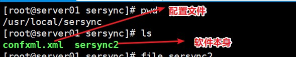
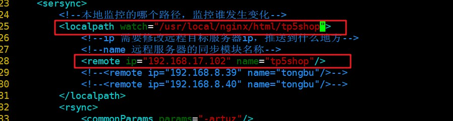

## 服务器相关参数

源服务器 192.168.17.101

目标服务器（同步到的服务器） 192.168.17.103

##目标服务器配置

###1、配置rsync服务

#### 1、安装rsync

```shell
yum -y install rsync
```

#### 2、配置rsync

```shell
vim /etc/rsyncd.conf
```

配置文件内容

```shell
uid = root
gid = root
use chroot = no
#设置允许登录的ip，这里没有限制IP
hosts allow=*
#设置最大连接数
max connections = 3
#设置启动rsync服务器的文件
pid file = /var/run/rsyncd.pid
lock file = /var/run/rsync.lock
#同步模块
[tp5shop]
#需要的文件及其文件夹路径
path = /usr/local/nginx/html/tp5shop
#备注
comment = tp5shop
#只读关闭
read only = false
```

#### 3、以守护进程方式启动rsync

```shell
/usr/bin/rsync --daemon
```

## 源服务器配置

```shell
cd /usr/local/
tar xzf sersync2.5.4_64bit_binary_stable_final.tar.gz
rm -rf sersync2.5.4_64bit_binary_stable_final.tar.gz
mv GNU-Linux-x86/ sersync
cd sersync
```



**配置serync示例文件说明**

```shell
<?xml version="1.0" encoding="ISO-8859-1"?>
<head version="2.5">
<host hostip="localhost" port="8008"></host> #保留字段，默认即可
<debug start="false"/> #是否开启调试模式,默认false即可
<fileSystem xfs="true"/> #是否开启支持xfs文件系统，Centos7默认都是xfs的了，所以建议true开启
<filter start="false"> #是否开启过滤模式，根据需求开启，例:过滤以.php结尾的文件(.*)\.php
<exclude expression="(.*)\.svn"></exclude> #过滤以.svn结尾的文件
<exclude expression="(.*)\.gz"></exclude> #过滤以.gz结尾的文件
<exclude expression="^info/*"></exclude> #过滤监控目录下的info路径
<exclude expression="^static/*"></exclude> #过滤监控目录下的static路径
<exclude expression="wwwroot/blogwhsir/*"></exclude> #过滤wwwroot/blogwhsir/目录下所有文件
</filter>
<inotify> #inotify监控事件
<delete start="true"/> #如果不开启此项，在删除监控目录下的文件时，目标服务器的文件则不会同时删除，根据需求开启
<createFolder start="true"/> #不开启不能监控子目录，建议true
<createFile start="false"/> #关闭提高通讯性能，默认就好
<closeWrite start="true"/>
<moveFrom start="true"/>
<moveTo start="true"/>
<attrib start="false"/>
<modify start="false"/>
</inotify>
 
<sersync>
<localpath watch="/opt/tongbu"> #指定要监控的本地目录
<remote ip="127.0.0.1" name="tongbu1"/> #指定要同步的目标服务器的IP地址，及目标服务器rsync的[模块]
<!--<remote ip="192.168.8.39" name="tongbu"/>-->
<!--<remote ip="192.168.8.40" name="tongbu"/>-->
</localpath>
<rsync> #配置rsync
<commonParams params="-artuz"/> #rsync的参数
<auth start="false" users="root" passwordfile="/etc/rsync.pas"/> #是否开启rsync的认证模式，需要配置users及passwordfile，根据情况开启（如果开启，注意密码文件权限一定要是600）
<userDefinedPort start="false" port="874"/><!-- port=874 --> #远程目标服务器的端口不是默认端口时使用
<timeout start="false" time="100"/><!-- timeout=100 --> #是否开启rsync的超时时间
<ssh start="false"/>
</rsync>
<failLog path="/tmp/rsync_fail_log.sh" timeToExecute="60"/><!--default every 60mins execute once--> #目标服务器传输失败时会重新传输，再次失败会写入rsync_fail_log中，每隔一段时间（timeToExecute）执行脚本再次传输
<crontab start="false" schedule="600"><!--600mins--> #对监控目录与目标服务器每隔一段时间进行一次整体同步，默认600分钟，根据个人情况是否开启
<crontabfilter start="false"> #如果之前开启了文件过滤，这里也要设置过滤
<exclude expression="*.php"></exclude>
<exclude expression="info/*"></exclude>
</crontabfilter>
</crontab>
<plugin start="false" name="command"/>
</sersync>
 
<plugin name="command"> #下面就是插件的设置（不做过多说明）
<param prefix="/bin/sh" suffix="" ignoreError="true"/> <!--prefix /opt/tongbu/mmm.sh suffix-->
<filter start="false">
<include expression="(.*)\.php"/>
<include expression="(.*)\.sh"/>
</filter>
</plugin>
 
<plugin name="socket">
<localpath watch="/opt/tongbu">
<deshost ip="192.168.138.20" port="8009"/>
</localpath>
</plugin>
<plugin name="refreshCDN">
<localpath watch="/data0/htdocs/cms.xoyo.com/site/">
<cdninfo domainname="ccms.chinacache.com" port="80" username="xxxx" passwd="xxxx"/>
<sendurl base="https://blog.whsir.com"/>
<regexurl regex="false" match="cms.xoyo.com/site([/a-zA-Z0-9]*).xoyo.com/images"/>
</localpath>
</plugin>
</head>
```

**修改使用配置文件**

```shell
<?xml version="1.0" encoding="ISO-8859-1"?>
<head version="2.5">
    <host hostip="localhost" port="8008"></host>
    <debug start="false"/>
    <fileSystem xfs="false"/>
    <filter start="false">
	<exclude expression="(.*)\.svn"></exclude>
	<exclude expression="(.*)\.gz"></exclude>
	<exclude expression="^info/*"></exclude>
	<exclude expression="^static/*"></exclude>
    </filter>
    <inotify>
	<delete start="true"/>
	<createFolder start="true"/>
	<createFile start="false"/>
	<closeWrite start="true"/>
	<moveFrom start="true"/>
	<moveTo start="true"/>
	<attrib start="false"/>
	<modify start="false"/>
    </inotify>

    <sersync>
    <!--监控本地目录-->
	<localpath watch="/usr/local/nginx/html/tp5shop">
	<!--目标服务器IP，同步到的服务器 name为目标服务器rsyncd.conf里配置的模块名称-->
	    <remote ip="192.168.17.105" name="tp5shop"/>
	    <!--<remote ip="192.168.8.39" name="tongbu"/>-->
	    <!--<remote ip="192.168.8.40" name="tongbu"/>-->
	</localpath>
	<rsync>
	    <commonParams params="-artuz"/>
	    <auth start="false" users="root" passwordfile="/etc/rsync.pas"/>
	    <userDefinedPort start="false" port="874"/><!-- port=874 -->
	    <timeout start="false" time="100"/><!-- timeout=100 -->
	    <ssh start="false"/>
	</rsync>
	<failLog path="/tmp/rsync_fail_log.sh" timeToExecute="60"/><!--default every 60mins execute once-->
	<crontab start="false" schedule="600"><!--600mins-->
	    <crontabfilter start="false">
		<exclude expression="*.php"></exclude>
		<exclude expression="info/*"></exclude>
	    </crontabfilter>
	</crontab>
	<plugin start="false" name="command"/>
    </sersync>

    <plugin name="command">
	<param prefix="/bin/sh" suffix="" ignoreError="true"/>	<!--prefix /opt/tongbu/mmm.sh suffix-->
	<filter start="false">
	    <include expression="(.*)\.php"/>
	    <include expression="(.*)\.sh"/>
	</filter>
    </plugin>

    <plugin name="socket">
	<localpath watch="/opt/tongbu">
	    <deshost ip="192.168.138.20" port="8009"/>
	</localpath>
    </plugin>
    <plugin name="refreshCDN">
	<localpath watch="/data0/htdocs/cms.xoyo.com/site/">
	    <cdninfo domainname="ccms.chinacache.com" port="80" username="xxxx" passwd="xxxx"/>
	    <sendurl base="http://pic.xoyo.com/cms"/>
	    <regexurl regex="false" match="cms.xoyo.com/site([/a-zA-Z0-9]*).xoyo.com/images"/>
	</localpath>
    </plugin>
</head>

```



**启动sersync服务**

```shell
/usr/local/sersync/sersync2 -n 10 -d -o /usr/local/sersync/confxml.xml
```

-n 启用线程数量 -d daemon方式启动 -o 指定配置文件 

**过滤不需要同步的文件**

```xml
第6行开始
<filter start="true">
          <exclude expression="(.*)\.cfg"></exclude>
          <!--<exclude expression="(.*)\.svn"></exclude>
          <exclude expression="(.*)\.gz"></exclude>
          <exclude expression="^info/*"></exclude>
          <exclude expression="^static/*"></exclude>-->
</filter>
```