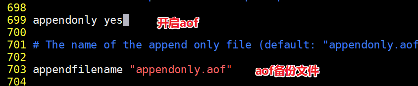
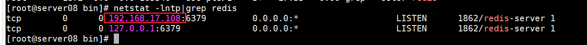
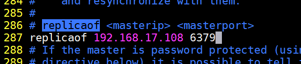
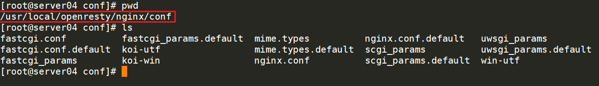

# 企业架构队列缓存中间件分布式Redis

> **学习目标和内容**
>
> 1、能够描述Redis作用及其业务适用场景
>
> 2、能够安装配置启动Redis
>
> 3、能够使用命令行客户端简单操作Redis
>
> 4、能够实现操作基本数据类型
>
> 5、能够理解描述Redis数据持久化机制
>
> 6、能够操作安装php的Redis扩展
>
> 7、能够操作实现Redis主从模式

# 一、背景描述及其方案设计

## 1、业务背景描述

> 时间：2016.9.-2017.6
>
> 发布产品类型：互联⽹动态站点 商城
>
> ⽤户数量： 10000-12000（⽤户量猛增）
>
> PV ： 100000-500000（24小时访问次数总和）
>
> QPS： 50-100*（每秒访问次数）
>
> DAU： 2000（每日活跃用户数）
>

## 2、模拟运维设计方案


根据以上业务需求，准备加入Redis缓存中间件服务器，可以使用到redis更加丰富的功能

在商城业务中实现：

①session共享存储到redis

②openresty（nginx+lua）动态限制IP访问

# 二、Redis介绍

## 1、介绍


Nosql 非关系数据库 key => value  键值对

Redis是**R**emote **D**ictionary **S**erver(远程数据服务)的缩写

由意大利人 antirez(Salvatore Sanfilippo)  开发的一款 内存高速缓存数据库

该软件使用C语言编写,它的数据模型为 key-value

它支持丰富的数据结构，比如 **String  list（双向链表）  hash（哈希）   set（集合）  sorted set（zset有序集合）**

可持久化（保存数据到磁盘中），保证了数据安全

## 2、业务使用场合

> **①[Sort Set]**排行榜应用，取top n操作，例如sina微博热门话题
>
> **②[List]**获得最新N个数据 或 某个分类的最新数据
>
> **③[String]**计数器应用
>
> **④[Set]**sns(social network site)获得共同好友
>
> **⑤[Set]**防攻击系统(ip判断)黑白名单等等

## 3、对比memcached

> ①Redis不仅仅支持简单的k/v类型的数据，同时还提供list，set，zset，hash等数据结构的存储。
>
> ②Redis支持master-slave(主—从)模式应用。
>
> ③Redis支持数据的持久化，可以将内存中的数据保持在磁盘中，重启的时候可以再次加载进行使用。
>
> ④Redis单个value存储string的最大限制是512MB， memcached只能保存1MB的数据
>
> ⑤redis是单核，memcached是多核
>

​	由于redis只能使用单核，而memcached可以使用多核，所以在比较上，平均每一个核上redis在储存小数据时比memcached性能更高。而却100K以上数据中，memcached性能要高于redis，虽然redis最近也在储存大数据的性能上进行优化，但是比起memcached还是有点逊色。结论是无论你使用那个，每秒处理请求的次数都不会成为瓶颈。

你需要关注内存使用率。对于key-vlaue这样简单的数据储存，memcached的内存使用率更高，如果采用hash结构，redis的内存使用率会更高，当然这都依赖于具体的应用场景。

# 三、安装和配置

官方网址：<https://redis.io/>

github: <https://github.com/antirez/redis>

## 1、源码编译安装

**①上传软件到目录中**

redis-4.3.0.tgz  php扩展   server01和server03安装

redis-5.0.5.tar.gz  redis软件   server08安装

**②解压编译安装**

```shell
shell > tar xvf redis-5.0.5.tar.gz
shell > cd redis-5.0.5
shell > make PREFIX=/usr/local/redis install
```

使用文件/usr/local/redis/bin

redis-cli  命令行客户端

redis-server  服务端

**③测试启动**

```shell
shell > cd /usr/local/redis/bin
shell > ./redis-server
```


## 2、后台启动配置

**①复制配置文件到软件目录下**


**②修改编辑配置文件**

```shell
shell > vim /usr/local/redis/bin/redis.conf
```


**③启动redis-server加入redis.conf参数**

```shell
shell > cd /usr/local/redis/bin
shell > ./redis ./redis-server
```

## 3、命令行客户端简单使用

telnet可以连接redis，没有本身redis-cli更加好用

**①简单的数据操作**


**②查看操作语法帮助**


**③系统状态信息**


# 四、数据结构类型操作

数据结构  存储数据的方式

数据类型

算法	取数据的方式  代码就把数据进行组合、计算、存储、取出

排序算法  冒泡 堆排序 二分

## 1、key

key的命名规则不同于一般语言，键盘上除了空格、\n换行外其他的大部分字符都可以使用

​	像“my key”和“mykey\n”这样包含空格和换行的key是不允许的。

我们在使用的时候可以自己定义一个Key的格式。

例如 object-type:id:field

Key不要太长。占内存，查询慢。

Key不要太短。像u:1000:pwd:123456   就不如   user:1000:password:123456  可读性好


默认在redis中，提供了16库

查看配置文件


## 2、String

string是redis最基本的类型

redis的string可以包含任何数据。包括jpg图片 base64或者序列化的对象

单个value值最大上限是512MB

如果只用string类型，redis就可以被看作加上持久化特性的memcached


## 3、List

key value(value1,value2,value3)

list类型其实就是一个双向链表。通过push,pop操作从链表的头部或者尾部添加删除元素

这使得list既可以用作栈，也可以用作队列

同一端进出  先进后出   栈

一端  另外一端出  先进先出  队列


首部（左 left）   尾部（右right）

需求：显示最后登录的几个用户

设计实现：

①登录一个用户，把用户名称或者id存储在list中

②从头部（左部）存，从头部取（左部）

用户：xiaoming  xiaohua  xiaobaitu

Key名称：lastlogin


实现：

**①最后登录的用户**

**②第一个登录的用户**


栈操作


队列操作


## 4、set

redis的set是string类型的无序集合。集合里不允许有重复的元素

set元素最大可以包含(2的32次方-1)个元素。

关于set集合类型除了基本的添加删除操作，其他常用的操作还包含集合的取==并集(union)，交集(intersection)，差集(difference)==。通过这些操作可以很容易的实现sns中的好友推荐功能。

Tip:mysql连表文氏图

<https://www.cnblogs.com/sunjie9606/p/4167190.html>

需求：实现朋友圈的存储和共同好友的计算

设计：

key                           value

xiaomingFR   xiaohong  xiaoqiang  xiaogang  xiaohei  xiaobai

xiaohongFR   xiaoming  xiaolv  xiaolan  xiaobai  xiaohei


实现：


交集 查看xiaohong和xiaoming的共同好友


并集 计算所有的朋友数量


差集  互相介绍好友


使用set建立黑名单（白名单）


## 5、zset

和set一样sorted set也是string类型元素的集合，有序集合，元素不允许重复

不同的是每个元素都会关联一个权。

通过权值可以有序的获取集合中的元素，可以通过score值进行排序

需求:实现手机APP市场的软件排名

设计：

Key : hotTop

id   Score    name

1     2        QQ

2     3        wechat

3     5        alipay

4     7        taobao

5     10        king

6      8         jd


score从小到大，jd排第5位，超过第4位taobao的排名

**①获取jd的score，taobao的score**


**②score从小到大排，jd的score调整到比taobao的score小**


8 +（-2) = 6


## 6、Hash

使用redis做缓存，可以使用hash结构，压缩效率和使用效率更高，比string

Hash存储数据和关系型数据库（mysql），存储的一条数据的结构极为相似

Key：value（field：value）


devops：(username:devops,phone:15313131313,email:123456@qq.com)

17301296261:(username:17301296261,phone:17301296261,email:devops@qq.com)


# 五、数据持久化操作

数据  持久化（数据在服务或者软件重启之后不丢失）

如果数据只存在内存中，肯定会丢失，实现持久化，就需要把数据存储到磁盘中（hdd ssd）

## 1、snappshoting（快照）

默认snappshoting是开启的，有一个备份的频率

通过查看配置文件可以看到


备份文件


测试备份频率

在5分钟内，进行10key的改变，查看备份效果


手动数据备份

127.0.0.1:6379> SAVE

数据恢复  需要先停掉redis服务

如果需要恢复数据，只需将备份文件 (dump.rdb) 移动到 redis 安装目录并启动服务即可

## 2、append only file

aof的备份频率


**①开启aof**

开启aof后，之前的redis里的数据会丢失



重启redis服务


**②查看aof效果**


总结：

snappshoting 一般的数据持久化使用，效率高，数据迁移方便

aof 适合于备份、数据实时性备份要求更高的情况

# 六、企业案例使用

## 1、主从模式

缓存集群架构示意图


> server08 master 192.168.17.107
>
> server09 slave 192.168.17.108
>

**①master配置**

```shell
shell > vim /usr/local/redis/bin/redis.conf
```

开启监听，在网络中与其他服务器进行网络交互的网卡，默认eth0

bind的ip指的是其他的主机需要和这个主机通讯的ip（这个的主机）


重启服务器并查看是否启动成功



**②slave配置**

```shell
shell > vim /usr/local/redis/bin/redis.conf
```


redis5.0之后的版本修改为参数replicaof



重启服务器并查看是否启动成功

**③查看效果**


Tip：

slave不允许写操作


是因为配置文件里进行了slave read-only设置，也是符合业务的使用需求


## 2、安全限制

==**IP限制登录**==

**①打开配置IP限制**

注意如果有防火墙，先关闭防火墙，或者开启端口限制

bind ip 监听绑定网卡的IP

```shell
shell > vim /usr/local/redis/bin/redis.conf
```


重启服务，检测是否启动成功

**②远程连接测试**


==**密码验证**==

**①修改配置文件**

```shell
shell > vim /usr/local/redis/bin/redis.conf
```


重启服务并检查是否启动成功

**②测试密码登录**


Tip：如果开启了密码限制，搭建主从需要在slave配置中填写master密码


## 4、PHP扩展安装

server01和server03上安装redis扩展

**①解压编译安装**

```shell
shell > tar xvf redis-4.3.0.tgz
shell > cd redis-4.3.0
shell > phpize
shell > ./configure && make && make install
```


**②配置文件php.ini开启**

```shell
shell > vim /usr/local/php/etc/php.ini
```


**③重启php-fpm服务器查看phpinfo**

```shell
shell > service php-fpm restart
```

查看phpinfo，需要编写一个php文件内容如下

```php
<?php
 	phpinfo();
```

通过浏览器访问编写的php文件页面,ctrl+f在搜索框里输入并查看


## 5、session存入redis

与之前session存储到memcached的方式一样，将session存储到redis中，也可以实现session的共享和实现单点登录(sso)的操作。

下面就是配置thinkphp框架存储session到redis中的示例配置文件。


##6、Nginx+lua+redis 实现访问攻击黑名单   WAF

<https://www.cnblogs.com/huligong1234/p/4163832.html>

**①安装openresty 和之前安装一致**



**②配置文件**


**③lua脚本文件**


**④测试效果**

超过访问计数之后，就禁止访问

