**学习目标:**

- [ ] 能够实现一个web页面的监测

- [ ] 能够实现自动发现远程linux主机

- [ ] 能够通过动作在发现主机后自动添加主机并链接模板

- [ ] 能够创建一个模版并添加相应的元素(监控项,图形,触发器等)

- [ ] 能够将主机或模板的配置实现导出和导入

- [ ] 能够实现至少一种报警方式(邮件,微信等)

- [ ] 能够通过zabbix_proxy来实现监控


## web监测

**web监测**：类似一个监控项,可以对一个url页面进行监测（监测它的状态码,页面匹配的字符串,响应时间,下载速度等）


web监测可以创建一个场景,并包含几个步骤


下面来做个例子（监测agent1的httpd的主页)

1, web管理界面－－》配置－－》主机－－》web监测（选agent1的web监测)－－》右上角点创建web场景

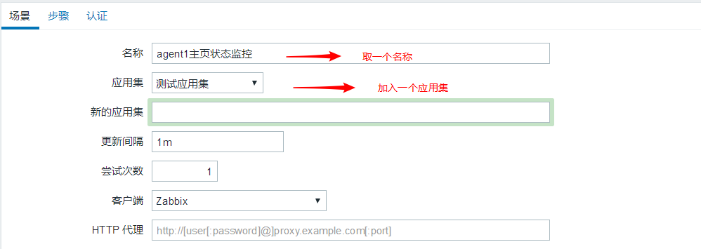

2，再点步骤，填上名称与监测的URL(你可以添加多个步骤，我这里只加这一个)


3，继续在步骤界面的最下面填上200状态码，然后点添加，出来后再点添加


4，创建完后，去下图中查看验证

* 如果看到是连接失败，则表示agent1的httpd没有启动
* 如果是404错误,则表示服务启动了,但找不到主页


5, 去agent1上安装httpd，并做一个主页，再重启服务

~~~powershell
[root@agent1 ~]# yum install httpd httpd-devel
[root@agent1 ~]# echo "agent1 主页" > /var/www/html/index.html
[root@agent1 ~]# systemctl restart httpd
[root@agent1 ~]# systemctl enable httpd
~~~

6，再去查看验证


练习:

1. 为上面的web监测创建一个图形
2. 为上面的web监测创建一个触发器,状态码不为200就触发（选监控项的时候要注意看清楚，一个web监测会产生好几个小的监控项，选状态码的那一个）


## 自动发现与动作

**发现**：假设我现在需要添加监控100台主机，这个工作量有点大。所以我可以把这100台连好网络，配置并启动好zabbix-agent服务。然后在zabbix server上配置一个**自动发现规则**，自动发现这100台主机。

自动发现是由**服务端主动发起**，Zabbix Server开启发现进程，定时扫描网络中符合条件的主机。

**动作**：自动发现了这100台主机，但是还要添加监控主机和链接模板啊。这时可以通过**动作**来达到此目的。


咱们前面早就准备了一台agent2，一直还没使用，这里就尝试自动发现这台agent2。

1,在agent2上安装zabbix-agent包

~~~powershell
[root@agent2 ~]# yum install zabbix-agent
~~~

2,配置zabbix-agent端的配置文件,启动服务并做成开机自动启动

~~~powershell
[root@agent2 ~]# vim /etc/zabbix/zabbix_agentd.conf
97 Server=10.1.1.11							修改成zabbix监控服务器的IP


[root@agent2 ~]# systemctl restart zabbix-agent
[root@agent2 ~]# systemctl enable zabbix-agent


[root@agent2 ~]# lsof -i:10050
~~~


**思考: 如果100台服务器都要装系统，然后再做上面两步，也挺累的。用什么方法来做更高效?**

答: 安装系统可以使用pxe(kickstart)或cobbler.安装软件，修改配置可以使用cobbler的postscript，再或者使用ansible,saltstack这种软件。


3, web管理界面－－》配置－－》自动发现

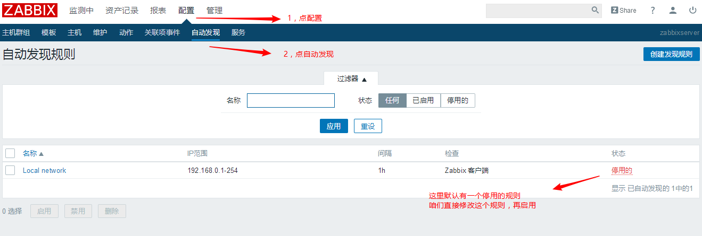

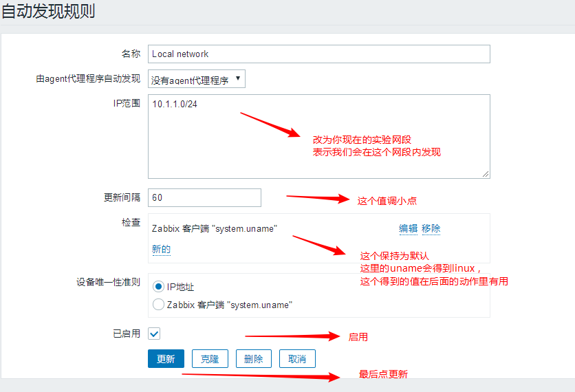


4, 自动发现规则启用后，按下图显示的去验证

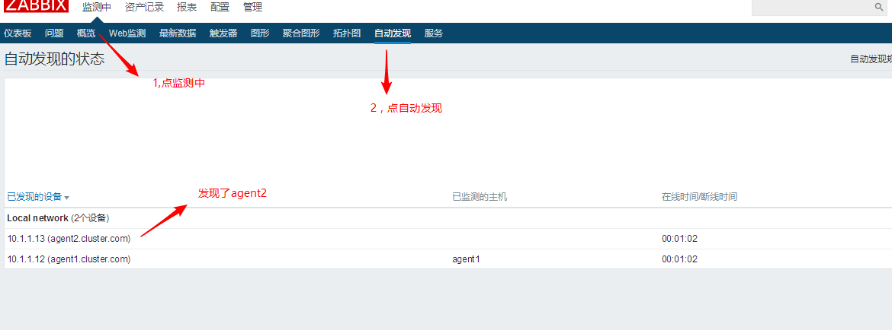

5，发现了agent2，但有一个问题，并没有把agent添加到监控的主机列表中，如下图所示


6，通过动作，将发现的主机添加到监控主机列表，并加上监控模板。

web管理界面－－》配置－－》动作－－》右上角事件源选自动发现－－》有一个叫Auto discovery. Linux servers的动作，直接启用就好


7, 再次验证就OK了（这里等待比较久，你也可以尝试把自动发现规则关闭一下，再次打开）


**课外拓展:** 自动注册

自动注册: 与自动发现实现的功能相同，区别在于自动发现是由zabbixserver去发现被监控机器。而自动注册是由被监控机器去找zabbixserver注册。

请问: 如果有大量的被监控机器，哪一种方式性能更好?


小结: 生产环境的自动化思路

* cobbler自动安装系统和系统初始化
* ansible实现配置自动化
* 自动发现加动作实现自动监控与模板链接


## 模板

**模板(template)**: 就是包括监控项，应用集，触发器，图形，聚合图形，自动发现规则，web监测等的一组实体。

使用模板可以方便链接到主机，更改模板也会将更改应用到所有链接的主机。

参考: https://www.zabbix.com/documentation/3.4/zh/manual/config/templates


web管理界面－－》配置－－》模板－－》创建模板


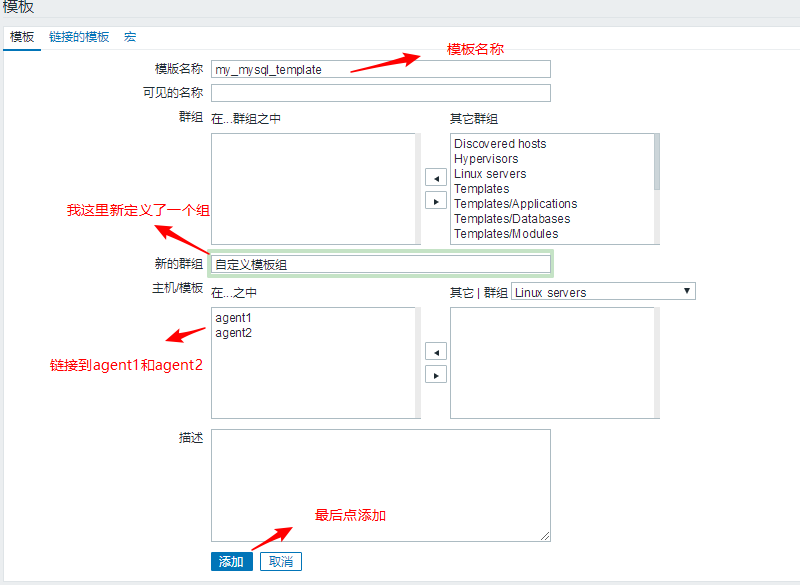


## 导入导出

辛辛苦苦配置了一个模板或一个主机，我想给另一台zabbix服务器使用或者我想保存下来，如何实现?

**导入导出**可以帮你轻松实现，导出的是**xml**格式文件.

**目的:**

*  备份防止误删除
* 将一台zabbix的模板配置迁移到另一台zabbix服务器


配置－－》主机－－》选取要导出的主机（前面打勾）－－》下面选择导出


配置－－》模版－－》选取要导出的模版（前面打勾）－－》下面选择导出


配置－－》主机－－》右上角导入

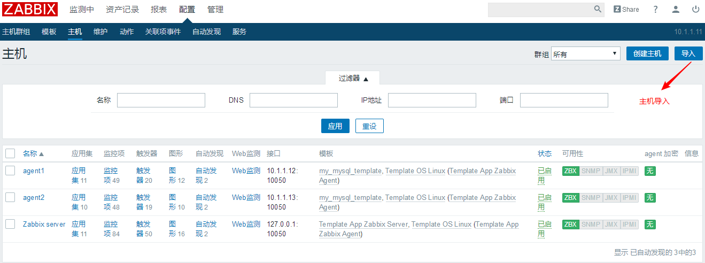


配置－－》模板－－》右上角导入


练习: 导入导出练习

1. 把本机的一个模版删除

2. 然后从同桌的zabbix服务器那导出成xml文件，并拷贝过来导入(里面有IP参数的要记得修改相应的IP)


##  报警

zabbix的报警媒介支持email,jabber,sms(短信),微信,电话语音等。


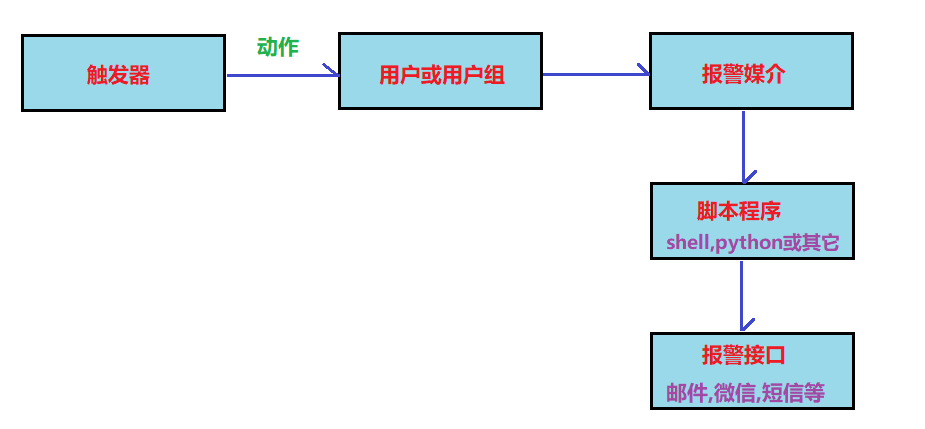


### 告警平台申请

自己配置报警比较复杂，而且邮件容易被拒或当做垃圾邮件。有些专业的报警平台就可以帮你简单实现。

如:onealeart   参考:http://www.onealert.com/

请先申请一个账号,绑定邮箱,手机,微信等。


登录进去后,按如下图示操作


### 告警平台增加zabbix应用

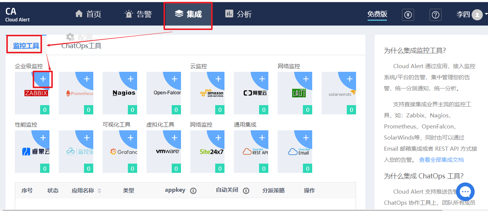


### 在zabbixserver安装告警平台agent


```powershell
按照它的提示，进行安装
[root@zabbixserver ~]# cd /usr/lib/zabbix/alertscripts
[root@zabbixserver alertscripts]# wget https://download.aiops.com/ca_agent/zabbix/ca_zabbix_relea                       se-2.1.0.tar.gz

[root@zabbixserver alertscripts]# tar xf ca_zabbix_release-2.1.0.tar.gz
[root@zabbixserver alertscripts]# cd cloudalert/bin/

[root@zabbixserver bin]# bash install.sh 2842d6d7-f7a1-fb97-254d-9be972403dd0
start to create config file...
Zabbix管理地址: http://10.1.1.11/zabbix
Zabbix管理员账号: admin
Zabbix管理员密码: 
......
```

### 验证安装

配置完onealert后，我们可以验证下它安装后到底对zabbix做了啥。简单来说，它做了三件事:

1. 增加了一个报警媒介类型
2. 增加了一个用户和一个用户组用于报警
3. 增加了一个报警动作

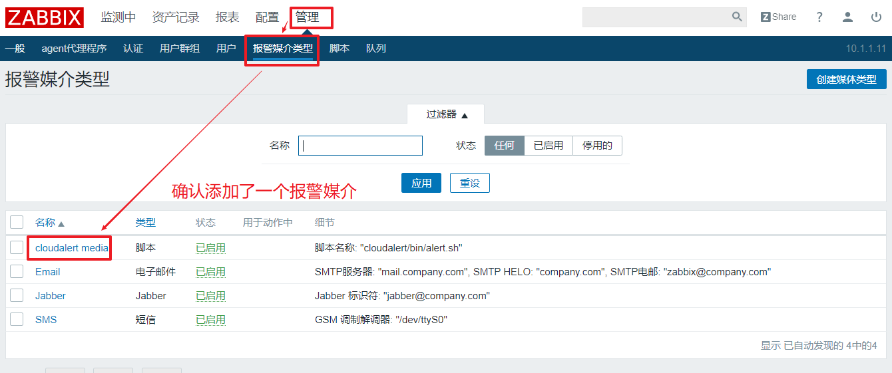


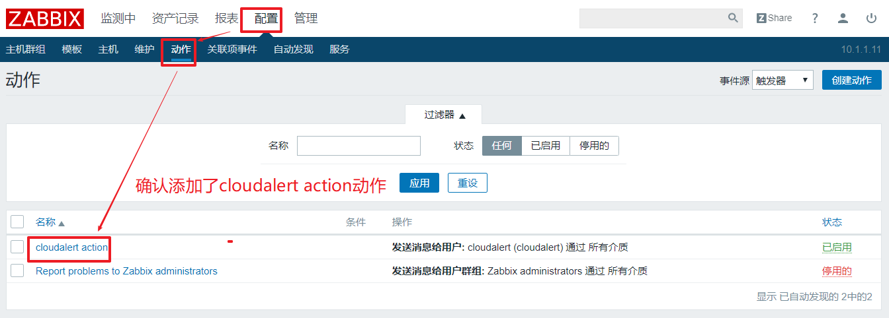

### 配置通知策略

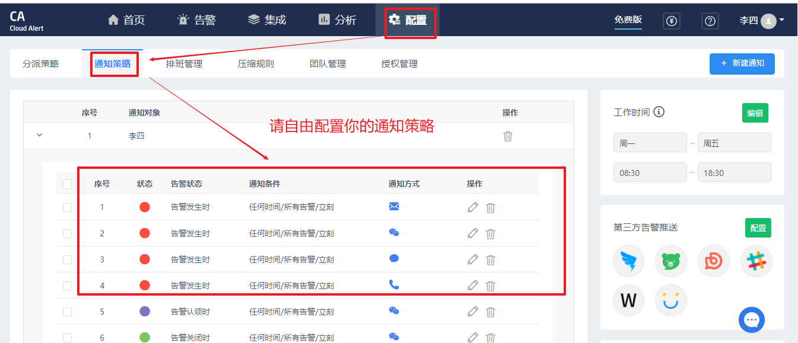


### 触发器触发告警

我们这里以前面都定义过的"agent1远程登录用户数"来测试报警，当agent1远程登录用户数大于20个就会触发器，然后报警。（**==注意==**:请在测试前先把agent1的登录用户数调整到20个以下)

验证: 将agent1远程登录用户数调整成大于20个，让触发器触发，也会触发报警。


## zabbix proxy

参考网址: https://www.zabbix.com/documentation/3.4/zh/manual/distributed_monitoring/proxies

### zabbix proxy的应用场景

**应用场景1: 跨内外网监控**

当zabbix server与被监控机器不在同一个机房时,跨公网监控会很麻烦, 也会带来安全隐患(比如有防火墙的情况,需要防火墙开放的端口增多。而且像mysql数据库这类应用是不适合直接被公网连接的)


**应用场景2: 分布式监控**

当监控机主机特别多,甚至分散在不同的地域机房。这个时候zabbix server压力很大，所以可以通过增加zabbix proxy来代理收集每个机房里的主机信息，再统一给zabbix server.

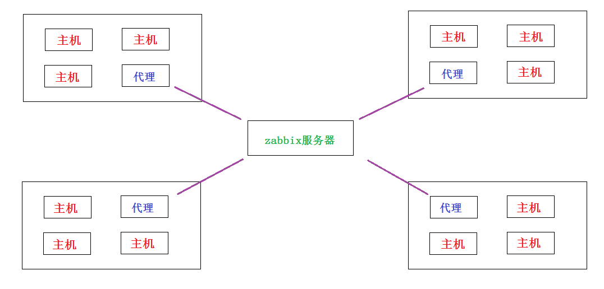

**zabbix proxy的两个主要应用场景总结:**

1. 分布式监控,为zabbix server分担压力
2.  zabbix server监控有防火墙的内网各服务器时，需要防火墙开放各个端口。使用zabbix proxy在内网统一监控，然后与zabbix server通过公网连接，此时防火墙只需要开放zabbix server与zabbix proxy的连接就可以了。


### **案例环境准备**

我这里把原来的agent2用来模拟zabbixproxy

1. 先在zabbix的web管理界面把agent2的配置删除（并把先前做的自动发现规则禁用,报警也禁用）
2. 把agent2主机名改成zabbixproxy.cluster.com并且三台重新绑定/etc/hosts

~~~powershell
# hostnamectl set-hostname --static zabbixproxy.cluster.com
# vim /etc/hosts
10.1.1.11       zabbixserver.cluster.com
10.1.1.12       agent1.cluster.com
10.1.1.13       zabbixproxy.cluster.com
~~~

3. 把zabbixproxy上的zabbix-agent服务先停一下

~~~powershell
[root@zabbixproxy ~]# systemctl stop zabbix-agent
~~~


### 案例实现过程

1. 在zabbixproxy上安装相关软件包

~~~powershell
[root@zabbixproxy ~]# yum install mariadb-server zabbix-proxy-mysql zabbix-agent
~~~

2，启动数据库，授权并导入数据

~~~powershell
[root@zabbixproxy ~]# systemctl restart mariadb
[root@zabbixproxy ~]# systemctl enable mariadb

[root@zabbixproxy ~]# mysql

MariaDB [(none)]> create database zabbix_proxy default charset utf8;
MariaDB [(none)]> grant all privileges on zabbix_proxy.* to 'zabbix'@'localhost' identified by '123';
MariaDB [(none)]> flush privileges;

[root@zabbixproxy ~]# zcat /usr/share/doc/zabbix-proxy-mysql-3.4.15/schema.sql.gz |mysql zabbix_proxy -u zabbix -p123
~~~

3, 修改zabbix_proxy上的配置文件,并重启服务

~~~powershell
[root@zabbixproxy ~]# vim /etc/zabbix/zabbix_proxy.conf
13 ProxyMode=0						  主动模式
24 Server=10.1.1.11			  		  zabbix_server的ip
43 Hostname=zabbixproxy.cluster.com   这个名字和你的主机名还有后面在web界面配置代理的名字保持一致  
156 DBHost=localhost				
167 DBName=zabbix_proxy
182 DBUser=zabbix
190 DBPassword=123			打开注释，并写上密码(与前面授权一致)
244 ConfigFrequency=60	主动模式下zabbix_proxy多久从zabbix_server接收一次配置数据
253 DataSenderFrequency=5 主动模式下zabbix_proxy多久发送一次收集的数据给zabbixserver

[root@zabbixproxy ~]# systemctl restart zabbix-proxy

[root@zabbixproxy ~]# systemctl enable zabbix-proxy
~~~

4, 如果zabbix_server也要监控zabbix_proxy的话,那么可以使用zabbix_proxy来代理自己(==可选步骤==)

~~~powershell
[root@zabbixproxy ~]# vim /etc/zabbix/zabbix_agentd.conf							
97 Server=10.1.1.13
138 ServerActive=10.1.1.13					自己代理自己,所以IP为zabbix_proxy的ip
149 Hostname=zabbixproxy.cluster.com

[root@zabbixproxy ~]# systemctl restart zabbix-agent
[root@zabbixproxy ~]# systemctl enable zabbix-agent
~~~

5, 修改agent1上的服务并重启服务

~~~powershell
把服务器的ip改成zabbix_proxy的ip，而不是zabbix_server的ip
[root@agent1 ~]# vim /etc/zabbix/zabbix_agentd.conf
97 Server=10.1.1.13								agent的被动模式
138 ServerActive=10.1.1.13						agent的主动模式
149 Hostname=agent1.cluster.com					agent的主动模式必须要加主机名

[root@agent1 ~]# systemctl restart zabbix-agent
~~~

6, 回到zabbix server的web管理界面创建主机,添加代理服务器为一台主机

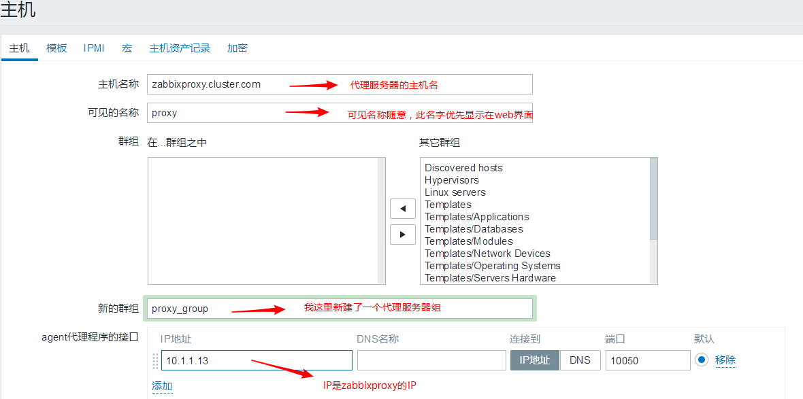

7, 增加代理, 代理自己和agent1

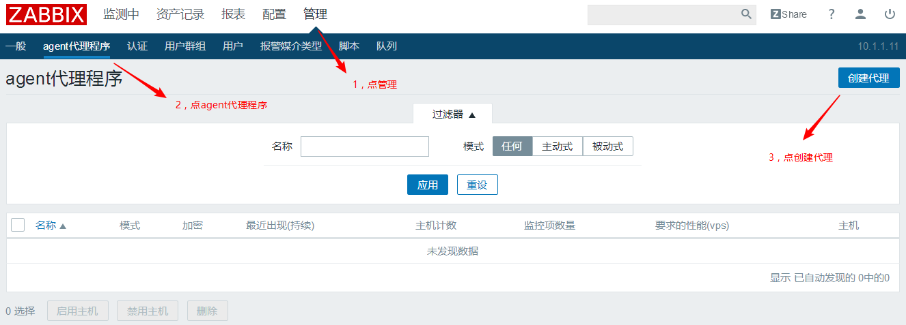


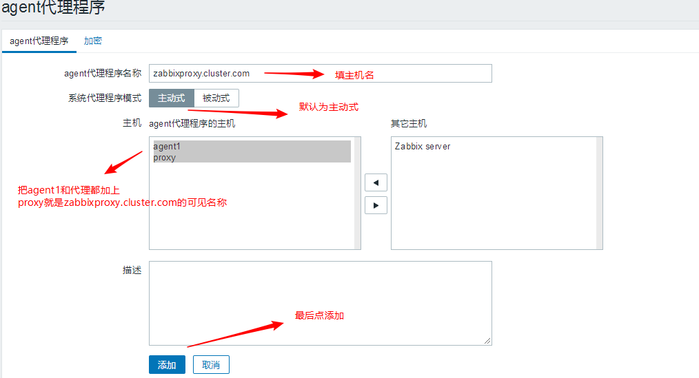


8, 验证测试

在agent1上找一个监控项做改变（比如登录用户数）,然后在zabbix_server的图形界面能看到这个改变，说明proxy成功.


## 主动监控和被动监控(拓展)


### agent被动模式

相对于agent的被动，也就是表示是server或proxy去找agent拿数据(这也是zabbix server的默认模式)

配置方法如下:

~~~powershell
agent端配置被动模式的参数如下
[root@agent1 ~]# vim /etc/zabbix/zabbix_agentd.conf
Server=10.1.1.13	IP为zabbix_proxy的ip(如果没有proxy，则直接为zabbix_server的ip)
[root@agent1 ~]# systemctl restart zabbix-agent
~~~


### agent主动模式

相对于agent的主动，也就是表示是agent主动把数据传给server或proxy

agent主动模式的优点是:  当agent太多的情况下，server或proxy去找这么多agent搜集数据，压力负载过大。用主动模式就可以缓解server或proxy的压力。

但用主动模式的问题是: 监控项也要转为主动式才行，而且很多zabbix自带模板里的监控项不支持转为主动式.

~~~powershell
agent端配置主动模式的参数如下
[root@agent1 ~]# vim /etc/zabbix/zabbix_agentd.conf
Serveractive=10.1.1.13	 IP为zabbix_proxy的ip(如果没有proxy，则直接为zabbix_server的ip)
[root@agent1 ~]# systemctl restart zabbix-agent
~~~

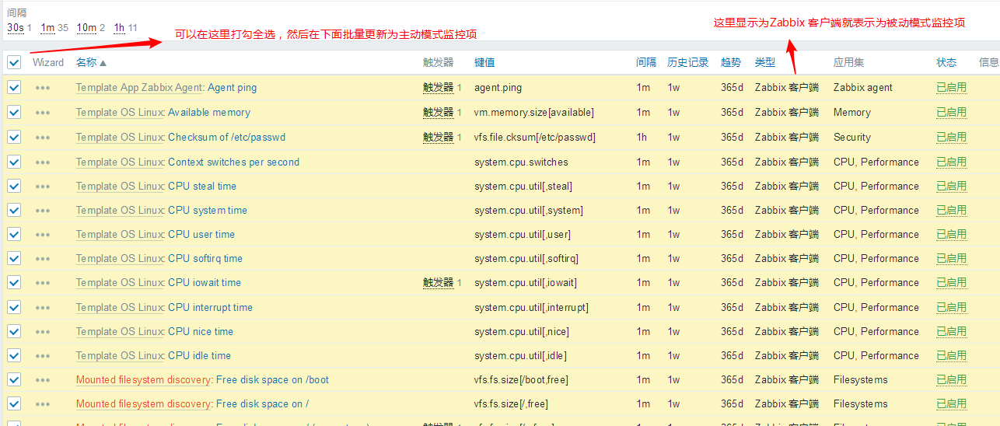


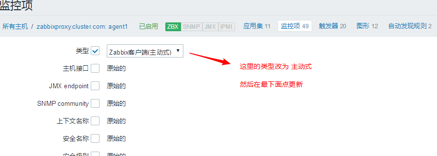


验证测试:

在agent1上把登录用户数再次调整,然后在zabbix_server的图形界面能看到这个改变，说明主动监控成功.


### proxy主动模式

zabbix_proxy主动发数据给zabbix_server(proxy的默认模式)

~~~powershell
# vim /etc/zabbix/zabbix_proxy.conf
ProxyMode=0							--此参数为0表示proxy主动模式	
~~~

### proxy被动模式

zabbix_server找zabbix_proxy为收集数据

```powershell
# vim /etc/zabbix/zabbix_proxy.conf
ProxyMode=1						   --此参数为1表示proxy主动模式			  
```


## 场景

场景: 公司大概十几台服务器(主要是lnmp环境)，现在需要你来设计并使用zabbix监控它们,并且要考虑以后的扩展，尽量使用自动的方式实现.


传智要做一个宣传网站--》1台--> 架构(高可用，负载均衡)--》监控(安装监控软件并连接) --》按需求设置监控模板--》 因公司发展，业务增长，服务器增加，我们得基础扩展监控模板 -----》公司再发展，有多个机房，我们要实现分布式监控+自动注册+主动被动模式的优化


操作的大概步骤: 

0. 创建管理用户并配置报警策略

1. 创建模版
2. 在模版里加应用集与监控项
3. 自定义配置每一个监控项(如要监测cpu,mem,io,disk use等等)
4. 为相应的监控项创建图形,有些监控项可以多个合成一个图形,也有些监控项(如返回的字符串这种)无法创建图形
5. 为相应的监控项设置触发器
6. 完成基本模版的创建(可考虑创建更多模版,也可考虑将模版导出备份)
7. 配置自动发现或自动注册规则
8. 配置动作(指定监控符合哪些条件的主机,并为他们加入哪个组和链接哪些模版)
9. 使用ansible这种配置自动化工具,把所有需要被监控的机器从zabbix-agent安装,配置,启动服务一体化完成
10. 实现自动发现或自动注册,让所有被监控的机器自动被监控
11. 增加分布式监控或调整主动被动模式进行优化


 


 